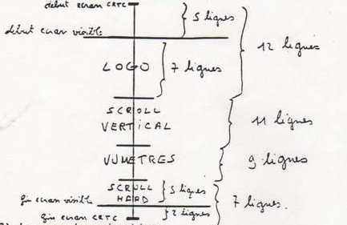
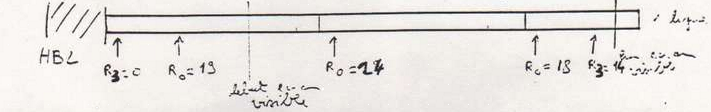
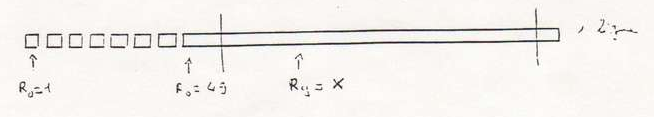

<https://amstradplus.forumforever.com/t283-Dossier-Rupture.htm>

The file is strictly reserved for PARADOX members. Do not distribute it to people outside the S.V.P.

I) THE CRTC. CATHODE RAY TUBE CONTROLLER.
=========================================

1 The registers.
----------------

The CRTC registers are 18 in number, but for breaks, only 10 registers are useful (registers 0,1,2,5,4,6,7,9,12 and 15). You are very familiar with registers 1,2,6,7,12 and 13, but registers 0,3,4 and 9 deserve some explanation.

a) Register 4.

This register defines the number of character lines that the electron gun must scan. This value is reduced by 1 compared to the actual number of character lines on the screen. For example, when you turn on the CPC, register 4 is 38, and the number of character lines on the screen is 37. So we have: R4 = number of character lines - 1.
The value of reg 4 can vary from 0 to 127. At 128, the CRTC loops, ie it returns to 0. For example, if you put 128 in reg 4, the CRTC will consider 128 as a 0. If you put 138, it will consider 138 as a 0, etc ...

b) Register 9.

This register defines the number of pixel lines there are in a character. It is also reduced by 1 from the actual number of lines per character. Reg 9 = number of scanlines per character - 1.
The normal value is 7 (therefore 8 lines per character (7 + 1)) this value can vary from 0 to 31. At 32, the CRTC loops.

c) Register 3.

It defines the width of the HBL (Horizontal Blanking), it is the black band that is on the left 'of the screen (we cannot see it, because it is too far to the left! This width is counted in words (1 words = 2 bytes) it varies from 0 (i.e. 0 bytes) to 15 (i.e. 30 bytes). At 16, it loops. The normal value is 14. The HBL is used for the electron gun to synchronize. When R3 value is too high, the cannon synchronizes badly and the screen is shifted (this bug is used to make hard byte scrolls, but the result is not very clean, because the scroll glass a little, because the gun is not well synchronized.) If the value is less than 4, the gun is so badly synchronized that the screen is no longer stable.

d) Register 0.

Ah, register 0. It has been used for a short time by demo-makers indeed, its operation and especially its usefulness was rather vague. This register corresponds in fact to reg 4, but horizontally. It defines the number of words that are on a line. Its normal value is 63. It is also decremented compared to the real number of words per line. So if R0 is 63, there are 64 words on a line, which is 128 bytes. Its value varies from 0 to 255.

2 How registers work.
----------------------------------

a) Registers 12 and 13.

These registers define the starting offset of the screen memory. This address is coded in 10 bits, from 0 to 9. Bits 10 and 11 are used for the screen size (16 or 32 KB), and bits 12 and 13 manage the video area used. your 2 registers are the only ones that can be buffered. That is, you can load them before the screen starts showing. If you break on 2 screens, you can change the offset of the second screen, while the first is displayed. The change of reg 12 and 13 will only be taken into account when the second screen begins.

b) The counter registers.

Registers 0,3,4 and 9 are counters. When CRTC displays a screen, it varies that part in its small circuits, the value of each of these registers. It has for each of these registers, a kind of variable. When we change the value of a reg, we change the maximum of the corresponding variable. For example, reg 4 is at 38 (its normal value), when the CRTC starts to display the screen, the variable is at 0, and each time it has finished displaying a character line, it increments the variable, until it reaches its maximum, which here is 38. At 38, the screen has finished being displayed, and it starts a new screen. Ditto for register 9, when the CRTC starts a character, the variable is 0, and at each end of line, it increments the counter, up to 7. At 7, the counter starts again at 0.

c) The overflow.

The overflow is an abnormal behavior of the CRTC due to the fact that one sends an incorrect value in a register. The most famous overflow is that of the reg 7, which allows to stick the screens in a break. Indeed, we put the reg 7 to 255, which is an overflow value, and as a result, the CRTC no longer produces VBL (which is the black band at the top of the screen, we can see it by putting the border to a value other than 0, and by gently turning the knob behind the monitor. This band allows the gun to resynchronize at the start of a screen display.) But there are other overflows. When you change the value of a counter register, an overflow can occur. For example, you set reg 4 to 20, but when you set this value, the variable of reg 4 is at 25. In this case, an overflow occurs. Indeed, you set the maximum of reg 4 at 20, but the counter is at 25, so before reaching 20, it will go up to its maximum (which is 127) so you will have a screen that scrolls, or flickers.

This is valid for all counter registers. You may have noticed an overflow by breaking by line. If you have 4 lines of identical characters at the start of the line by line break, this is due to an overflow. You set reg 9 to 0, while the counter is for example at 2. In the case, the reg 9 goes to its maximum, which is 31 (32 lines of pixels, that makes 4 lines of characters.)

3 The types.
------------

CRTCs are classified into 5 types. Types 0, 1 and 2 are for old generation CPCs. CRTC 2 is the most difficult to master, in fact its structure is much less flexible than the other CRTCs. To program it in normal break, it is necessary to respect many rules. In more modern ruptures (line to line, verticals, etc ...) it is almost impossible to achieve this, because it crashes when asked for things too pushed (If we do for example R4 = 0 and R9 = 0, it crashes.) In short, it's a shitty CRTC, if you have one, you only have one solution left: SUICIDE.

CRTC 3 is CPC +, and 4 is an almost non-existent type. Recently, LONGSHOT and OVERFLOW have created a new type of ranking. Indeed, the old system was not very reliable. On all the CRTC 0 did not react the same way, ditto for the other types. So a new classification was needed. Now, there are only 2 types, type A and type B. These 2 types include all the old types, except types 2 (well, the real types 2, because some CRTC responds to type 2 to the LONGSHOT test, but are actually types 1 or 0.) Here is how we recognize type A from type B:

Type A:
- transparent scroll by REG 6
- RVI not buggy
- Non-buggy RVMB

Type B:
- transparent scroll by REG 8
- Bugged RVI
- Buggy RGB

For the meaning of RVI and RVMB, see below. If you want to know if you have a CRTC A or B, launch the NEW AGE 1 demo. If the message: PRESS A appears, you have a CRTC type B, if the message PRESS B appears, you have a CRTC type A. So that makes sense!

4 The rules.
-------------

When you start to modify CRTC registers in a rather barbaric way, you have to respect certain rules/invariants, if you do not want to end up with a crash.
First of all, register 7 must be less than or equal to register 4. But this rule is only applied when the gun is at the bottom of a screen, and it is going to generate a VBL. Indeed, when in a break you put the reg 7 to 255, there is no crash because in scanning, you put the 7 back to a normal value.
Reg 2 must also be lower or equal to register 0, this rule must be observed in all cases.
On CRTC 2, the sum of registers 2 and 3 must be less than or equal to register 0.
Register 3 must be greater than or equal to 4, otherwise the gun does not have time to synchronize, and the screen is no longer stable.
It is also necessary that during a break, there is in total, a number close to 312 lines of pixels per screen. With CRTC 2, you have to be very, very close to 312, the others accept a greater margin of error. The number of lines is given by registers 4,5 and 9. Well, here is a summary in formulas of the conditions, with in addition, 2 or 3 other conditions:

- reg 7 <= reg 4
- reg 2 <= reg 0 (CRTC 2: reg 2 + reg3 <= reg 0)
- reg 3> = 4
- (reg4 + 1) * (reg9 + 1) + reg5 = 312 (with very large margin according to CRTC.) (1)
- reg 6 <= reg 7
- reg 1 <= reg 2

For formula (1), when using breaks, you have to add all the lines for each screen, and this sum must be equal to 312. If you have a break with X screens, this is what it gives:

```
            rupture 1                                 rupture 2                                   rupture X
((reg 4 + 1) * (reg 9 + i) + reg 5) + ((reg 4 + 1) * (reg 9 + i) + reg 5) + ... + ((reg 4 + 1) * (reg 9 + i) + reg 5) = 312
```

Yeah, I know, it might sound a bit tricky, but it's actually quite simple. We must always keep in mind that we must have a line number close to 312.

---

II) The synchronisation.
========================

In breaks, time sync is very important. In a classic break, the sync is not very difficult to manage because it is usually done using HALTs. But in a line-by-line break, you have to be in sync down to the line, and in vertical breaks, you have to be in sync down to the NOP! It is therefore fundamental to know how to calculate the machine time.

First of all, it is useful to know that the HALTs intervene every 52 lines. There are 6 HALTs per full screen, so that's a good 312 lines in total (6 * 52). If we modify the length of a line (with register 0) the HALTs will no longer be every 52 lines. If you set R0 to 31 (so at half its value) you will have HALTs every 26 lines. In fact, on a real screen line, we will have 2 lines for the CRTC. If you don't understand very well, that's okay, I would come back to this topic about vertical breaks.

Now let's come to the computation of machine time. If you look at the tables of computer times that there are on certain books, you come up with these times in micro seconds, or in clock cycles. All of this is not practical. I will give you a table with the times in NOPs below. The NOP being one of the fastest instructions, I used the NOP to calculate the machine time of the other instructions.

On a screen line, there is the equivalent of 64 NOPS (when R0 = 63). If you are making a raster, your looping routine must have an execution length of 64 NOPs, otherwise the raster will be offset.

I found the machine time tables in most books to be messed up. Indeed, the times given were completely wrong. Some books even went so far as to give fractional machine times! Indeed, here is an example: LD A, n 7 microseconds, which makes 1.75 NOPs. This is totally bad because the Z80 in the CPC works in 4 cycle increments (so 1 NOP), it cannot execute the end of one instruction, and the start of another on the same 4 cycle slice. Well, here is a machine time table that I calculated myself (thanks to a raster.)

The times are expressed in NOP:

* Length table omitted statement; it's readily available elsewhere *

Phew! Voila, you can trust this table at 100%, it is totally correct (unless you made a typo.) Come on, let's do a little computer time calculation exercise:

```
LOOP    LD A, (HL); 2
        INC A; 1
        ADD A, 5; 2
        SLA A; 2
        LD (HL), A; 2
        OUT (C), A; 4
        INC HL; 2
        DJNZ LOOP; 3 and 2 when B will be at 1 (at the end of the loop)
```

total: 18 and 17 at the end of the loop.

I have no idea what this loop can be used for, I typed it without thinking, it's just an example.

---

III) The classic break.
==========================

1 The format.
------------

When we want to make a break, we must first define its format, that is to say the number of screens and their height. We must then transform these heights into values ​​to send to the CRTC (just reduce the height by 1.) Let us take for example a break with 4 screens. The sum of the heights (in characters) of the screens must be 39.

On the monitor we can see about 32 character lines. There are still 2 character lines below, and 5 character lines above (this is only valid in the structure that I suggest. This structure is the simplest to succeed in any break.)

Well, in our break, we want there to be a hard scroll of 5 lines of characters at the bottom. This gives us a screen 5 lines high, at the very bottom, but given that there are still 2 character lines below we will add 2 lines to this screen, to thus have a screen at the bottom of 7 lines (5 will be seen, and the last 2 will be too low.) we want to put a logo at the top on a screen of 7 lines above. We must add 5 lines because there are 5 which are not visible above, this gives us a total of 7 + 5 = 12 character lines at the top.

Huh? Kwa? You do not understand anything ? Wait, I will draw a further picture for you to understand better. Okay, so we have a screen at the bottom of 7 lines, and one at the top of 12 lines. We want to put below the logo a vertical scroll of 11 lines high, so we have a screen of 11 lines. And finally below the vertical scroll, a fixed screen, to put meters for example. This screen will be 9 lines high. Voila, let's check that the total is 39: 12 + 11 + 9 + 7 = 39, no problem. The values ​​to send to CRTC are: 11 (12-1), 10 (11-1), 8 (9-1), and 6 (7-1) Here is a little drawing that sums it all up.

```
Start CRTC screen ---------------->
5 lines                           |
Start visible screen -------------| 12 lines
Logo (7 lines)                    |
----------------------------------<

Scroll vertical (11 lines)        > 11 lines
                                  |
----------------------------------<

VU meters (9 lines)               > 9 lines
                                  |
----------------------+-----------<
    Hard scroll       | 5 lines   |
- end visible screen--+-----------| 7 lines
  end CRTC screen     | 2 lines   |
----------------------+-----------+
```



2 Synchronization.
---------------------

To change the reg 4, you must be in sync, for that we will use the HALTs. To make it all clear, we make a small drawing, on which we represent the screen. Each box corresponds to a character line. We place the HALTs (every 52 lines of pixels, therefore, every 6.5 character lines (52/8=6.5)) We draw our screens according to their size, and we thus obtain the position of the changes screen compared to HALTs. Looking further, there is this drawing and also drawings of other examples. (Grid sheet 1)

3 The change of registers.
------------------------------

First of all, so that our screens are glued, we put at the start of the scan, the reg 7 to 255, this register is in overflow, so the screens will be glued. After BD19, we put a small loop to make sure that the CRTC has started to display the screen. Now, we can start doing our breakups.

After the loop, we set the maximum of R4 at 11, to indicate the size of our first screen.

After the 1st HALT, we will still be on the first screen.

After the 2nd HALTs, we will be on the 2nd screen, so we can change R4 for this screen and we set it to 10, so we define the size of the 2nd screen.

After the 3rd HALT we will still be on the 2nd screen.

After the 4th HALT, we will be on the 3rd screen, so we change R4 to define our 3rd screen. We set R4 at 8.

After the 5th HALT, we will be on the last screen, we change R4, and we put it to 6. But beware, we are in the particular case where the start of the screen is less than 1 character before the HALT, and in this case, you have to set a small delay before changing R4 and R7.

Voila, our break is made, it is not more difficult than that.

There is just one more thing to do, which is to set R7 to a non-overflowing value, otherwise the screen will not be stable. So, after the last HALT, we set R7 to 0. I advise you to always set R7 to 0 and not another value, at the end of the scan this allows you to apply what I have just explained to you. If you put any other value, your screen schema will be different.

4 Watch out for overflow
------------------------

In the example I took, I was careful that there is no overflow problem when changing register 4, but when you do your breaks, you will have to pay attention to this problem. To avoid this problem, when you modify register 4, a number of lines must have elapsed less than or equal to the number of lines in the previous screen. Here are some concrete examples.


You must also be careful when a screen starts very close to a HALT (example, breaks 1 and 5 of the grid sheet. The last screen of these breaks starts very close to the 5th HALT.) In this case, it is preferable to put a small delay before changing register 4. This is to avoid compatibility problems. Indeed, from one CRTC to another, there are small variations when the HALTs arrive, so when a screen starts within one character line of a HALT, set a delay ( see in the examples on the disk.)
There are therefore 6 examples of breaks on the disk to illustrate this part. These breaks are detailed on the squared sheet. After these explanations, you are normally able to achieve any classic break.

---

IV) The line to line break.
==============================

1 The principle.
----------------

The principle of line-to-line breaking is very simple. All you have to do is put registers 4 and 9 to 0, and set R7 at 0 or 255, depending on the case. We set R7 to 0, if we start the break line by line immediately after the FRAME. If after this break by line, we put other screens, it is necessary to set R7 to 255, because one returns in the case of traditional ruptures. If you make a line by line break after a screen, you must set R7 to 255, as for a classic break. In summary, just after the FRAME: set R7 = 0. After a screen: set R7 = 25S.

For the CRTC, each line will represent a screen. Indeed, the register represents the size in height of a screen, this one being at 0 the screen made for the CRTC 1 characters high. Register 9 is 0, so each character is 1 line high, so each screen is 1 line high! Once you have changed registers 4, 9 and 7, and if there is no overflow, the line-to-line break begins, and it works by itself. You no longer need to change the registers 4,7 and 9, you just have to change registers 12 and 13.

2 Ah, the overflow!
-------------------

Yes, for the line to line break, you must respect 2 overflows, that of register 4 and that of register 9. To avoid any problem, you can make the modifications at the very start of the scan, so register 4 is still at 0, so there is no overflow of this register. On the other hand, register 9 will certainly not be at 0 so it will overflow. But this is not a problem because an overflowing register 9 produces a character of 32 lines high before making characters of 1 line high, and thus before reaching the beginning of the visible screen, the electron gun traverses 5 lines of characters (which is 40 lines of pixels.) Therefore, when arriving at the start of the visible screen, the overflow will be terminated, and the reg 9 will behave normally. Here is a small drawing to make things clearer.


If you want to make your break line by line in the middle of the screen, you cannot use this method, since you will have to set the reg 4 and 9 to zero in the middle of the screen, and in this case we would see the overflow of register 9. It is therefore necessary to synchronize the change of regs 4 and 9. This synchronization must be done to the exact line! You still have to work on paper to see what you are doing (see squared sheet number 2.) The only way is first of all to identify roughly where the change of reg 4 and 9 is located, and to make your routine according to this approximation. With this approximation you have a 7 out of 8 chance of having a reg 9 overflow, so to remove it, you work trial and error, adding or removing 64 NOPs (64 NOPs being the time it takes for the gun to traverse a line.)

3 The management and display of a break per line.
-------------------------------------------------

Yes, now that you know how to mute all lines, you need to know how to modify the address for all lines. For this, we always use registers 12 and 13. As I said previously, you no longer have to modify registers 4, 7 and 9, it suffices to change 12 and 13, but not arbitrarily, you need a good sync, and you have to know how to manage the addresses of each line. For address management, I advise you to make a table of the addresses of each row, and you change this table for each screen refresh. Then, during the display, you will find the address, and send it in the reg 12 and 13. Then, you have to wait until you are on the next line, you have to synchronize your routine, to change the 12 and 13 always at the same time on the lines, it is necessary to act as if it were a raster. The routine can look like this for example:

```
; HL points on the address table (value R12 then R13)
; A = number of lines
; BC = #BC0C

LOOP    OUT (C), C  ; Select the reg 12
        LD D, (HL)  ; Read the value of R12
        INC HL      ; Increase the reading position in the table
        INC B       ; B = #BD
        OUT (C), D  ; Send the value of R12
        INC C       ; Increase C, which now contains 13
        DEC B       ; B = #BC
        OUT (C), C  ; Select reg 13
        LD D, (HL)  ; Read the value of R13
        INC HL
        INC B       ; B = #BD
        OUT (C), D  ; Send the value of R13
        DEC C       ; Reset C to 12
        DEC B       ; B = #BD
        DEFS 30,0   ; corresponds to 30 NOPS, for synchronization
        DEC A
        JR NZ, LOOP
```

The loop is 64 NOPs of machine time, so the synchronization is perfect, registers 12 and 13 will always be changed at the same time on each line. To modify registers 12 and 13 you can go faster using the OUTI instruction, but here it is not useful. Attention, the OUTI instruction is a bit special, I will tell you about it later.

4 The advantages, the disadvantages
-----------------------------------

The main advantage of the line to line break is to be able to change the offset of the screen on each line (this is why the line to line break was invented.) This allows for example to do distorting a logo by giving the impression that it is spinning the author of a soul (in the part of PICT in THE DEMO, and also in the PHOENIX PART of LONGSHOT still in THE DEMO.) This also makes it possible to bounce several scrolls identical texts at the same time (in the part of SLASH in FUCKING EXAM) There are still plenty of other things that can be done with a line break.

But the main drawback of this kind of rupture is that it consumes video memory space, for unspectacular effects. Indeed, a line representing a screen, and given that by regs 12 and 13 you can only address the start of a memory block (You can only address zones #0000-#07FF, #4000-#47FF , #8000-#87FF and #C000-#C7FF) you have in each space of #4000 bytes, only #800 bytes of video memory, which is 25 pixel lines (for 80 byte lines.) This is due to the fact that you cannot set values ​​such as #C800, #D000 ... as the start screen offset.

If you use all the memory, you will only have 200 lines of pixels, and you will not be able to do any more screens, or hardware scrolls, because an area used by a line-by-line break cannot be used for another type of break, otherwise, you would have this character at the start of each line, which is in your break by line. On the other hand, you can in this zone, put DATAs, musics, or code, provided to put it outside the memory addressable by the reg 12 and 13, that is to say, between #0800 and #3FFF , #4800-#7FFF, #8800-#BFFF and between #C800-#FFFF. In summary, if in the #4000-#7FFF zone (for example) you break by line, you will have between #4000 and #47FF the content of the break by line, and you can put something else between #4800 and #7FFF (data, music, code, etc ...) but you will not be able to do anything else with this area (such as a hard scroll, or a fixed screen.)

To remedy the fact that you cannot address all of the memory through reg 12 and 13, OVERFLOW, invented RVI (invisible vertical rupture), and what I have built is RVMB (multi-block vertical rupture), but I'll tell you about that later.

---

V) The vertical break.
======================

1 The principle.
----------------

The vertical break was invented by LONGSHOT, but his technique was not very interesting, it was OVERFLOW which really made the first USABLE vertical break.
The vertical break is nothing more than an extension of the line break. We now know how to shut off all lines. But what if we shrink the length of a line? How will you tell me? Well with the reg 0. The register 0 defines the length of a line in word (1 word = 2 bytes.) Its normal value is 63 (therefore 64 words, which makes 128 bytes.) If we put the reg 0 at 31 (so 32 words, or 64 bytes.) the line would be cut in 2.

Ouch, right in the middle of a line he's got a big HBL, yuck, that's ugly. To remove it, he sets register 3 to 0. Voila, there are no more HBLs, but the break is not very straight.

We now have a vertical fracture such as LONGSHOT discovered some time ago (December 1990 to be exact.) But the fracture not being straight, we cannot use it. Why is the break not right? Good because register 3 is at 0, so at the start of the line the gun does not have time to synchronize, and the screen is not stable. It was not until December 1991 that OVERFLOW (again!) Had the idea of ​​changing R3 while the line was displayed so that the gun could synchronize. So his idea is to set R3 at 0 at the start of the line, so as not to have HBL between the pieces of screens on a line, and to set R3 at 14 (or a value between 4 and 15) at the end of the line for the gun to synchronize. Well, a little drawing is in order. Here is:


And here is a perfect vertical break! Cool right?

2 Other Vertical Breaks.
------------------------

We are not limited to 2 screens per line (yes, because now, each screen is no longer 1 line, but half a line, or even less!) We can put 4,8,16,32, etc. But let's say that above 4 screens per line, it becomes difficult to correctly manage the break. To have 4 screens per line, you need lines 4 times smaller, so 128/4 = 32. 32 bytes are 16 words. It is therefore necessary to put in the reg 0 the value 15 (16-1).

If you want 8 screens per line, put the value 7 (8-1) in reg 0. You can also do 3.5 or 6 screens, but for that you have to change register 0 on each line. Let us imagine that we want to have 3 screens on a line, the first of 40 bytes, next of 50 bytes, and the last of 38 bytes (40 + 50 + 38 = 128. It is absolutely necessary that the total length is 128 bytes. .)

To do this, proceed as for a normal break, but this time, by changing register 0, 3 times per line. At the start of the line, we put in R0 the value 19 (40 bytes make 20 words, so we put 19 = 20-1)

Then, you have to change R0 a second time, for the 2nd screen. But beware of the overflow, you have to wait until the 2nd screen has started to be displayed, before changing R0. Ditto for the 3rd screen of the line. Then we start again on the next line. Come on, another little drawing:



If you want to do a vertical 5-screen break, you can do it the same way. Here is a small example:


3 Little things to know.
------------------------

When doing a vertical break, you can recenter the screens with reg 2, as if there was no break, but you have to respect the rule: R2 < R0. If you want to change the mode to be the screens of a line (yes, yes, it is possible, by the way, I am thinking of doing it for my part of OBSESSION.) Which therefore corresponds to changing the mode on the same line , it is necessary that between the screens of the line, there is a small HBL (R3> = 2) if R3 <2 one cannot change the mode. But in this case, be careful, indeed, if in your vertical break, you do not set R3 to 0 at the start of the line, but to another value, you will no longer be able to center the screens with R2.
To manage your break, I advise you to use the same principle as with the break by row, that is to say to make an array, and to make a routine which makes exactly 64 NOPs. Moreover, a good sync is essential, because it is necessary to be synchro to the NOP meadows! And yes, it is hard. In addition, if your break is very complex, remove the loop to save machine time (you will gain 4 NOPS, or more depending on your routine) and copy the routine as many times as there are lines.

To go even faster in changing registers, you can use the OUTI instruction. But be careful, this instruction decrements the B register, BEFORE performing the OUT, so if you want to send the content of HL to the #BD port, you will have to do:

```
LD B, #BE
OUTI
```

The OUTI instruction replaces this:

```
DEC B
OUT (C), (HL) ; (That does not exist)
INC HL
```

All this in 5 NOPs, it's super fast isn't it? This is especially very useful when you have a table of screen offsets. You point HL to this offsets table, and you use OUTI.

In a vertical break, you still have to pay attention to one thing, and that is the fact that by changing R0, you change the arrival of the HALTs. Indeed, the HALTs arrive every 52 lines, but to count the end of line, the CRTC looks at R0. If we set R0 to 31 (therefore 2 screens per line), for the CRTC, it has 2 lines for 1. Therefore, the HALTs will arrive twice as often, that is to say, every 26 lines. If you have X screens per line, HALTs will arrive every 52 / X lines. Come on, I'll give you a few more tips, which can be useful. When you want to send a value to ports #BC or #BD, you can also use ports #0C and #0D, or ports #8C and #8D. What is it used for? It is used to gain registers. Well yes, to select register 12, instead of: LD BC, #BC0C: OUT (C),C you can do: LD B,#0C: OUT (C),B. And #8C and #8D, what's the point? It is useful for mode changes. You have the value for the CRTC port, and the value to send to change the mode. All this to save registers.

In your loops, you cannot use register B (it contains the value of the port), so you can use register A. But if in your loop, register To is modified, instead of doing a PUSH AF in start of the loop, and a POP AF at the end of the loop, you can put at the start and end of the loop: EX AF, AF '. This stuff is pretty well known, but I'll give it away, in case you haven't heard of it yet. To use this, you have to cut the interrupts, otherwise you will lose the value of A.

4 Advantages, disadvantages.
---------------------------

The disadvantages are the same as for a line-to-line break, ie the need for a large memory space, and the waste of video memory. The advantages are to be able to change the starting offset of the screen, several times per line. It does things like the intro to S&KOH, I don't have any other examples, because no one else has done a vertical break yet (yes, me, but I haven't not yet released a demo that uses it, there are also the Germans of the 5KB group who have fun with the vertical break, and I think that's it.) It's a whole new technique, which deserves that we are interested.

---

VI) RVMB, RVI
=============

Well, here we are getting into really serious things. All there was before was fun. RVMB, and especially RVI, are the most recent techniques. Only one demo was made with the RVI, it is the famous S&KOH. As for RVMB, no demo has used it yet, but it is usable.
These 2 techniques aim to make a line by line break, where you can put any memory area on the screen. With a classic line-to-line break, we are limited to the first #800 bytes of an area. With RVMB and RVI, all memory can be used.

1 Vertical Multi-Block Rupture (RVMB)
-------------------------------------

By "block", I'm referring to one of the 8 #800 byte areas on a screen. These are the 8 zones which correspond to the 8 lines of characters. On a screen at #C000, the 8 blocks are: #C000-#C7FF, #C800-#CFFF, #D000-#D7FF, #D800-#DFFF, #E000-#E7FF, #E800-#EFFF, #F000 -#F7FF and #F800-#FFFF. I remind you that with a classic line to line break, we can only use the first block (#C000-#C7FF).

The RVMB consists of making a vertical break of 8 screens. Each screen is a different block. For that, we set R0 to 7, R4 to 0, and R9 to 7. Then, we start the vertical break by setting R3 at 0 at the beginning of the line, and setting it to 14 at the end of the line. And we manage the offset changes as for a classic line to line break. Since R9 is at 7, and R0 is at 7, the offset cannot change once per line (for it to change several times, R9 must be 0), and the 8 screens of the line will be 16 bytes wide. So we get this:


With a normal line line, we use at each line, 80 bytes (if R1 = 40) or more, of the first block (the only addressable.) Here, we use 16 bytes, the rest of the line is located on the others blocks. So, with an RVMB, we can make 128 different break lines with an area of ​​#4000 bytes (instead of 25 with a normal line to line.)

But there is a big problem, it is that this technique does not work on the CRTC type B (in about 1 CPC in 2 or 3) therefore, we cannot use this technique if we want a total compatibilities. In fact, on type B CRTCs, we can set R3 = 0 at the start of the line, but there is still a small HBL between the screens of a line.

So with an RVMB, the line is cut by these HBLs. This remark is therefore also to be taken into account for classic vertical breaks. Indeed, you must be careful that the edges of your screens will be slightly 'reign' on type B (there is about 1 byte of HBL between the screens.)

2 The RVI.
----------

Well, I haven't experimented with this technique yet, so I'm talking about it theoretically.

In RVI, you have to make a vertical break that you don't see! In fact, the vertical break is very much to the left, so it cannot be seen on the monitor. We start with R4 at 0 and R7 at 255 (to have a line-to-line break) and R2 at 0 (to hide the vertical breaks.) Then, we start the vertical break. At the start of the line, we set R0 to 1, (we do not need to set R3 to 0, it is irrelevant as the breaks are hidden.) We wait a little, so that it has displayed 7 screens, and then we set R0 to 49 (we have 64: (49 + 1) + 7 * (1 + 1) = 64.) and we modify R9 in order to have the block that we are interested in screen. It is also necessary to change R12 and R13 of course. Clearly, it looks like this:



So, we can change R12 and R13 as we want, but we are on the same block you tell me. Well no, because as I said, we change R9 on each line, in order to have the block we want. Come on, an example. On the screen, we have block 0, we want block 1 in the next line, we put in R9 the value 5. On the next line, there are 7 small screens. The first screen will be on block 0, the second on block 1, the third on block 2, the fourth on block 3, the fifth on block 4, and the sixth on block 5. As we have fixed R9 to 5, on the next screen, the blocks start again at 0. Therefore, the seventh screen will be on block 0, and finally, the last screen, the one we have on the screen, will be on block 1. If at the following line you want block 3 you put in R9 the value 5. On the next line, the first screen will be on block 2 (because in the previous line, the last screen, the one that is seen, was on block 1.), the second on the block 3, the 3rd on block 4, the fourth on block 5, the fifth on block 0 (because we set R9 to 5) the sixth has 1, the seventh has 2, and the last, the one that is the screen, is on block 3.

(pelrun's note:

```
next C9 = (current C9+7) mod (R9+1)
or equivalently
next C9 = (current C9+6) mod R9
```

easy! :o
)

This is the principle of RVI, it's very complicated to understand, but once we understand (I understood, but I have not yet put into practice.) We can do this with our eyes closed.

Well, as this was not complicated enough, there are still compatibility problems on type B. Indeed, on type B, the first screen of the line is not taken into account by the CRTC, so , we must act as if there were only 6 screens before the one we see. Which makes for a whole different routine.
In addition, there are combinations that you cannot have. Indeed, one cannot have on a line a block 1, and on the line below, a block 6 (for example.)

Well, there you go, I wouldn't expect more on the subject because I don't know him well enough yet. If this really interests you, maybe I will do a full RVI brief later (once I've put it into practice.)

He has a lot of courage OVERFLOW to have done this in his demo! And he deserves to have invented this technique, because it is really twisted.

---

VII) CRTCs adaptation
======================

A quick word on the differences between CRTCs, in order to have routines 100% compatible with all CRTCs.
For the classic break, if you use my method, and if you set the delays when needed (when a screen starts near a HALT) your break will be compatible with all CRTCs (even type 2!)

If you make a line-to-line break, to go from one CRTC to another, just add or remove 64 NOPs before changing R4 and R9 (in the examples of line-to-line breaks that there are on the disk, I put a loop before changing R4 and R9. The loop is 64 NOPs (there is a DEFS 61,0, which replaces 61 NOPs, and the DJNZ, which is 3 NOPs of machine time, therefore 61 + 3 = 64 NOPs.) So, if there is the overflow of R9, change the value of B (it is normally sufficient to increase or decrease it by 1.)

And for vertical breaks, you have to increase or decrease by 1 line (like for a line-to-line break) and also, increase or decrease only a few NOPs.

These timing changes are identical for all CRTCs of the same type. You just have to test whether to go from CRTC 0 to CRTC 1, you need to add or remove 64 NOPs, etc ...

---

VIII) THE END.
==============

There you go, it's over! I told you everything I know. I hope to have been clear. I hope you will have understood, and that it will have helped you. Excuse the spelling and style mistakes!

I am leaving you telling you that ALL ruptures are possible. It is enough to pose the problem well, to draw a beautiful little drawing, and to respect what I told you.

If you have a problem, if you want additional information, contact me. Bye...

GOZEUR.


