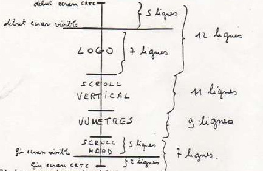
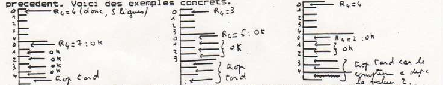
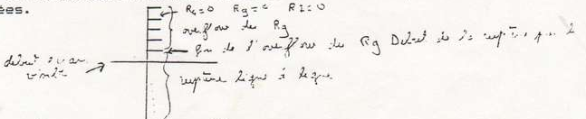
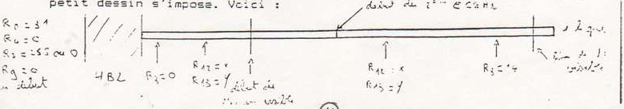
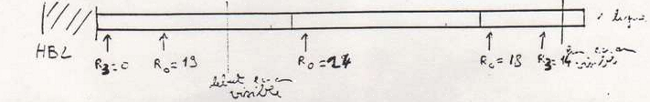
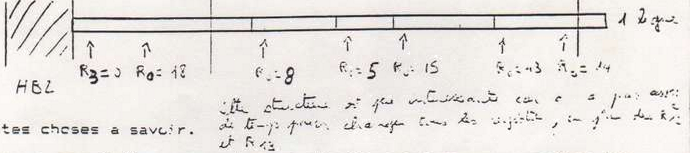
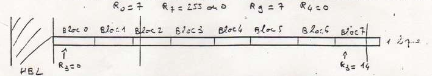
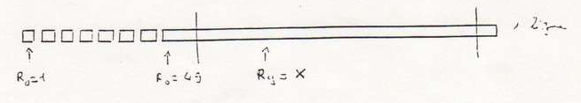
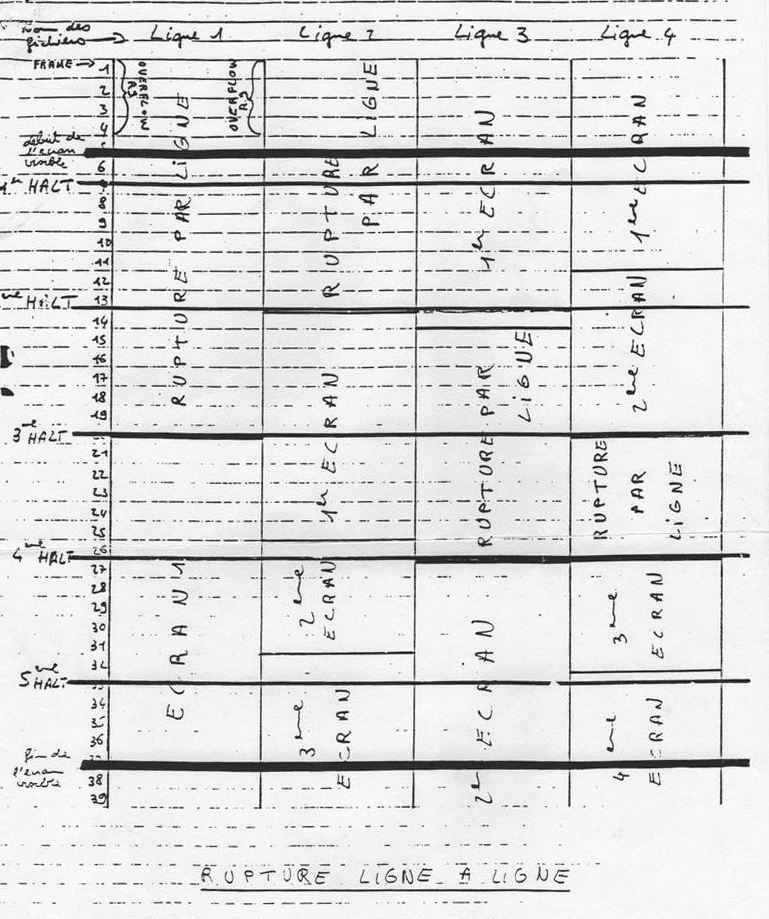

<https://amstradplus.forumforever.com/t283-Dossier-Rupture.htm>

La dossier est strictement reservé aux membres de PARADOX. Ne pas le diffuser à ses personnes etrangéres au groupe S.V.P.

I) LE CRTC. CATHODE RAY TUBE CONTROLLER.
========================================

1) Les registres.
-----------------

Les registres du CRTC sont au nombre de 18, mais pour les ruptures, seuls 10 registres sont utiles (les registres 0,1,2,5,4,6,7,9,12 et 15). Vous connaissez très bien les registres 1,2,6,7,12 et 13, mais les registres 0,5,4 et 9 méritent quelques explications. 

a) Le registre 4.

Ce registre défini le nombre de ligne de caractère que doit balayer le canon a électrons. Cette valeur est diminuée de 1 par rapport au nombre réel de ligne de caractère a l’écran. Par exemple, quand vous allumez le CPC, le registre 4 est a 58, et le nombre de ligne de caractère a'l’écran est de 37. on a donc : R4=nb de ligne de caractère - 1
La valeur du reg 4 peut varier de 0 a 127. À 128, le CRTC boucle, c'est à dire qu'il revient à 0. Par exemple, si vous mettez 128 dans le reg 4, le CRTC conciderera le 128 comme un 0. Si vous mettez 138, il conciderera le 138 comme un 10, etc... 

b) Le registre 9.

Ce registre défini le nombre de ligne de pixel qu’il y a dans un caractère. Il est également diminué de 1 par rapport au nombre réel de ligne par caractère. Reg 9= nb ligne par caractère - 1. 
Le valeur normale est ce 7 (donc 8 lignes par caractère (7+1)) cette valeur peut varier de 0 sa 31. A 32, Le CRTC boucle.

c) Le registre 7.

Il défini la largeur de la HBL (Horizontal Blanking), c'est la bande noire qu’il y a tout gauche’ de l’écran (on ne peut pas la voir, car elle est trop a gauche! Cette largeur est définie en MOT (1 MOT=2 octets) elle varie de 0 (doc 0 octets) a 15 (donc 30 octets). A 16, ça boucle. La valeur normale est 14. La HBL sert au canon à électrons a se synchroniser. Lorsque la valeur du R3 est trop passe, le canon se synchronise mal et l’écran est décale (ce bug est utilise pour faire des scrolls hards a l'octet, mais le résultat n'est pas très propre, car le scroll vitre un peu, car le canon n'est pas bien synchronise. Si la valeur est inférieure à 4, le canon est si mal synchronise que l’écran n'est plus stable.
  
d) Le registre 0.
 
Ah, le registre 0. Il est utilisé depuis peu de temps par les demo-makers en effet, son fonctionnement et surtout son utilité était assez vague. Ce registre correspond en fait au reg 4, mais en horizontal. Il defini nombre de MOT qu'il y a sur une ligne. Sa valeur normale est 63. Il est lui aussi decrementé par rapport au nombre réel de MOT par ligne. Donc, si le R0 est à 63, il y a 64 MOTs sur une ligne, ce qui fait 128 octets. Sa valeur varie de 0 a 255.

2) Le fonctionnement des registres. 
-----------------------------------

a) Les registres 12 et 13. 
    
Ces registres définissant l'offset de départ de la mémoire écran. Cette adresse est codée sur 10 Bits, de 0 a 9. Les bits 10 et 11 sont utilises pour la taille de l’écran (16 où 32 Ko), et les bits 12 et 13 gèrent la zone vidéo utilisée. tes 2 registres sont les seuls à pouvoir être bufferisé. C'est a dire que vous pouvez les charger avant que l’écran ne commence a être affiché. Si vous faites une rupture sur 2 écrans, vous pouvez changer l’offset du deuxième écran, pendant que le premier est affiché. Le changement des reg 12 et 13 ne sera prit en compte que lorsque le deuxième écran commencera.

b) Les registres compteurs. 
      
Les registres 0,3,4 et 9 sont des compteurs. Lorsque CRTC affiche un écran, il fait varier que part dans ses petits circuits,la valeur ce chacun de ces registres. Il possédé pour chacun de ces registres, une sorte de variable. Lorsque l'on change la valeur d'un reg, on change le maximum de la variable correspondante. Par exemple, le reg 4 est à 38 (sa valeur normale), quand le CRTC commence a afficher l’écran, la variable est à 0, et a chaque fois qu'il a fini d'afficher une ligne de caractère, il incrémente la variable, jusqu’à ce qu'elle atteigne son maximum, qui est ici 38. A 38, l’écran a fini d’être affiché, et il commence un nouvel écran. Idem pour le registre 9, quand le CRTC commence un caractère, la variable est a 0, et à chaque fin de ligne, il incrémente le compteur, jusqu’à 7. A 7, le compteur recommence à 0.

c) L'overflow.

L'overflow est un comportement anormal du CRTC du au fait que l'on envoie une valeur incorrecte dans un registre. L'overflow le plus connu est celui du reg 7, qui permet de coller les écrans dans une rupture. En effet, on met le reg 7 a 255, qui est une valeur overflow, et de ce fait, le CRTC ne produit plus de VBL (qui est la bande noire tout en haut de l’écran, on peut la voir en mettant le border à une autre valeur que 0, et en tournant doucement le bouton qu'il y a derrière le moniteur. Cette bande permet au canon de se resynchroniser en début d'affichage d'un écran.) Mais 1 y à d'autres overflows. Lorsque vous modifier la valeur d'un registre compteur, il peut se produire un overflow. Par exemple, vous mettez le reg 4 a 20, mais au moment su vous mettez cette valeur, la variable du reg 4 en est a 25. Dans ce cas, il se produit un overflow. En effet, vous fixer le maximum du reg 4 a 20, mais le compteur en est a 25, donc, avant d'arriver a 20, il va aller jusqu’à son maximum (qui est 127) vous allez donc avoir un écran qui défile, ou qui scintille.
Ceci est valable pour tous les registres compteurs. Vous avez peut-être constaté un overflow en faisant de la rupture par ligne. Si vous avez Vars en début de rupture ligne a ligne, 4 lignes de caractères identiques, cela est du a un overflow. Vous mettez le reg 9 a 0, alors que le compteur en est par exemple a 2. Dans le cas, le reg 9 va a son maximum, qui est 31 (32 lignes de pixels, ça fait bien 4 lignes de caractères.)

5) Les types.
-------------

Les CRTCs sont classés en 5 types. Les types 0, 1 et 2 sont pour les CPCs vielle génération. Le CRTC 2 est le plus difficile a maîtriser, en effet, sa structure est beaucoup moins souple que les autres CRTCs. Pour le programmer en rupture normale, il faut respecter de nombreuses régies. En ruptures plus modernes (ligne a ligne, verticales, etc...) il est presque impossible d'y parvenir, car il plante lorsqu'on lui demande des choses trop poussés (Si l'on fait par exemple R4=0 et R9=0, ca plante.) Bref, c'est un CRTC de merde, si vous en avez un, il ne vous reste plus qu'une solution: LE SUICIDE. 
Le CRTC 3 est celui du CPC+, et le 4 est un type quasiment inexistant. Depuis peu de temps, LONGSHOT et OVERFLOW ont crée un nouveau type de classement. En effet, l'ancien système n'était pas très fiable. Sur tous les CRTC 0 ne réagissaient pas de la mémé façon, idem pour les autres types. Donc une nouvelle classification s'imposait. Maintenant, il n'y a plus que 2 types, type A et type B. Ces 2 types regroupes tous les anciens types, sauf les types 2 (enfin, les vraix types 2, car certain CRTC répondent type 2 au test de LONGSHOT, mais sont en réalité des types 1 où 0.) Voici a quoi on reconnaît un type A d'un type B :

Type A:
- scroll transparent par REG 6 
- RVI non buggée 
- RVMB non buggée

Type B :
- scroll transparent par REG 8 
- RVI buggée 
- RVMB buggée

Pour la signification de RVI et RVMB, voir plus loin. Si vous voulez savoir si vous avez un CRTC A ou B, lancer la demo NEW AGE 1. Si le message : PRESS A apparait, vous avez un CRTC type B, si le message PRESS B apparait, vous avez un CRTC type A. C'est logique tout ca !

4) Les regles.
--------------

Lorsque l'on commence a modifier les registres CRTC de façon assez barbare, il faut respecter certaines regles, si l'on ne veut pas se retrouver avec un plantage. 
Tout d'abord il faut que le registre 7 soit inférieur où égal au registre 4. Mais cette regle n’est qu'a appliquée lorsque le canon se trouve en bas d'un écran, et qu'il va générer une VBL. En effet, lorsque dans une rupture vous mettez le reg 7 a 255, il n'y à pas plantage car en balayage, vous remettez le 7 a une valeur normale.
Il faut également que le reg 2 soit inférieur où égal au registre 0, cette regle doit être observée dans tous les cas. 
Sur les CRTC 2, il faut que la somme des registres 2 et 3 soit inférieure ou égale au registre 0. 
Le registre 3 doit être supérieur ou égal a 4, car sinon, le canon n'a pas le temps de se synchroniser, et l’écran n'est plus stable.
Il faut également que lors uns rupture, il y ai au total, un nombre proche de 312 lignes de pixels par écran. Avec les CRTC 2,  il faut être très très proche de 312, les autres accepte une marge plus grande d'erreur. Le nombre de ligne est donné par les registres 4,5 et 9. Bon, voici un resumé en formules des conditions, avec en plus, 2 ou 3 autres conditions :

- reg 7 <= reg 4
- reg 2 <= reg 0 (CRTC 2 : reg 2+reg3 <= reg 0) 
- reg 3 >= 4
- (reg4+1)*(reg9+1)+reg5=312 (avec marge tout grande suivant CRTC.) (1)
- reg 6 <= reg 7
- reg 1 <= reg 2 

Pour la formule (1), dans une rupture, il faut faire la somme de toutes les lignes pour chaque rupture, et cette somme doit être égale à 312. Si vous avez une rupture a X écrans, voici ce que ca donne :

```
            rupture 1                     rupture 2                         rupture X 
((reg 4+1)*(reg 9+i)+reg 5) + ((reg 4+1)*(reg 9+i)+reg 5) +...+ ((reg 4+1)*(reg 9+i)+reg 5) = 312
```

Oui, je sais, ca parait peut être un peu compliqué, mais en fait, c’est tout simple. Il faut toujours garder à l'esprit que l'on doit avoir un nombre de ligne proche de 312.

---

II) La temporisation.
=====================

Dans les ruptures, la temporisation est très importante. Dans une rupture classique, la tempo n'est pas très difficil a gérer car elle se fait en général a l'aide des HALTs. Mais dans une rupture ligne a ligne, il faut être synchro a la ligne près, et dans les ruptures verticales, il faut être synchro au NOP près! Il est donc fondamental de savoir calculer le temps machine.
Tout d'abord, il est utile de savoir que les HALTs interviennent toutes les 52 lignes. Il y a 6 HALTs par balayage, donc cela fait bien 312 lignes au total (6*52). Si on modifie la longueur d’une ligne (avec le registre 0) les HALTs ne seront plus toutes les 52 lignes. Si vous mettes le R0 a 31 (donc, a la moitié de sa valeur) vous aurez des HALTs toutes les 26 lignes. En effet, sur une ligne réelle d’écran, on aura 2 lignes pour le CRTC. Si vous ne comprenez pas très bien, ce n'est pas grave, je reviendrais sur ce sujet a propos des ruptures verticales. 
Maintenant, venons en au calcul de temps machine. Si vous regardez les tables de temps machine qu'il y a sur certain livres, vous venez ces temps en micro secondes, où en cycles d'horloge. Tout cela n'est pas pratique. Je vous donnerais plus loin un tableau avec les temps en NOPs. Le NOP étant une des instructions les plus rapides, je me suis base sur le NOP pour calculer le temps machine des autres instructions. 
Sur une ligne d’écran, il y a l’équivalent de 64 NOPS (lorsque R0=63).
Si vous faites un raster, il faut que votre routine qui boucle ait une longueur d’exécution de 64 NOPs, sinon le raster sera decalé.
Je me suis rendu compte que les tables de temps machine de la plupart des livres étaient foireuses. En effet, les temps donnés étaient complètement faux. Certain livres allaient même jusqu’à donner des temps machines a virgules ! En effet, voici un exemple : LD A,n 7 micro seconde, ce qui fait 1,75 NOPs. Ceci est totalement debil car le Z80 fonctionne en tranches de 4 cycles (donc 1 NOP), il ne peut pas exécuter la fin d'une instruction, et le début d’une autre sur la même tranche de 4 cycles. Bon, voici une table de temps machine que j'ai calculée moi-même (grâce a un raster.) 

Les durées sont exprimées en NOP:

*Instruction length table omitted; it's readily available elsewhere*

Ouf ! Voila, vous pouvez vous fiez a cette table a 100%, elle est toit à fait correcte (a moins d'avoir fait une erreur de frappe.) Allez, on fait un petit exercice de calcul de temps machine : 

```
BOUC    LD A, (HL)  ;2
        INC A       ;1
        ADD A,5     ;2
        SLA A       ;2
        LD (HL),A   ;2
        OUT (C),A   ;4
        INC HL      ;2
        DJNZ BOUC   ;3 et 2 quand B sera a 1 (en fin de de boucle)
```

total: 18 et 17 en fin de boucle.
 
Je ne sais pas du tout à quoi peut servir cette boucle, je l'ai tapée sans réfléchir, c'est juste un exemple.

---

III) La rupture classique. 
==========================

1) Le format.
-------------

Lorsque l'on veut faire une rupture, il faut tout d'abord définir son format, c'est a dire le nombre d’écrans et leur hauteur. Il faut ensuite transformer ces hauteurs en valeurs a envoyer au CRTC (il suffit de diminuer la hauteur de 1.) Prenons par exemple une rupture avec 4 écrans. La somme des hauteurs (en caractère) des écrans doit être 39.
Sur le moniteur nous voyons a peut près 32 lignes caractères. Il y à encore 2 lignes caractères en dessous, et 5 lignes caractères au dessus (ceci n'est valable que dans le structure que je vous propose. Cette structure est la plus simple pour réussir n'importe quelle rupture.)
Bon, dans notre rupture, on veut qu'il y ai en bas, un scroll hard de 5 lignes de caractères. Ceci nous fait un écran de 5 lignes de haut, tout en bas, mais étant donnée qu'il y a encore 2 lignes caractères en dessous on va ajouter 2 lignes a cet écran, pour avoir ainsi un écran en bas de 7 lignes (5 seront vues, et les 2 dernières seront trop basses.) on veut mettre tout en haut un logo sur un écran de 7 lignes ce haut. Il faut ajouter 5 lignes car il y en a 5 qui ne sont pas visibles au dessus, ceci nous fait donc un total de 7+5=12 lignes caractères en haut. Hein ? Kwa? Vous ne comprenez rien ? Attendez, je ferais un dessin plus loin pour que vous compreniez mieux. Bon, on a donc un écran en bas de 7 lignes, et un en haut de 12 lignes. On veut mettre en dessous du logo un scroll vertical de il lignes de haut, on a donc un écran de il lignes. Et enfin en dessous du scroll vertical, un écran fixe, pour mettre des vumètres par exemple. Cet écran sera de 9 lignes de haut. Voila, vérifions que le total fait 39 : 12+11+947=39, pas de problème. Les valeurs a envoyer à CRTC sont : 11 (12-19, 10 (11-1), 8 (9-1), et 6 (7-1). Voici un petit dessin qui resume le tout.



2) La synchronisation.
---------------------

Pour effectuer les changement des reg 4, il faut être bien synchro, pour cela on utilisera les HALTs. Four que tout cela soit clair, on fait un petit dessins, sur lequel on représente l’écran. Chaque case correspond à une ligne de caractère. On place les HALTs (toutes les 52 lignes de pixels, donc, toutes les 6,5 lignes de caractère (92/E=6,5)) On dessine nos écrans en fonction de leur taille, et on obtient ainsi la position des changements d’écran par rapport aux HALTs. Regarder plus loin, il y a ce dessin et aussi des dessins d'autres exemples. (Feuille quadrillée 1)

3) Le changement des registres. 
-------------------------------

Tout d'abord, pour que nos écrans soit collés, on met au début du balayage, le reg 7 à 255, ce registre est en overflow, donc les écrans seront collés. Après le BD19, on met une petite boucle pour etre certain que le CRTC ait commencer d'afficher l’écran. Maintenant, on peut commencer 2 faire nos ruptures. Après la boucle, on fixe le maximum du R4 a 11, pour lui indiquer la dimension de notre premier écran. Après le 1er HALT, nous seront toujours sur le premier écran. Après le 2eme HALTs, nous seront sur le 2eme écran, donc, on peut changer le R4 pour cet écran et on le met à 10, ainsi on défini la taille du 2eme écran. Après le 3eme HALT nous seront toujours sur le 2eme écran. Après le 4eme HALT, nous seront sur le 3eme écran, on change donc le R4 pour définir notre 3eme écran. On met le R4 a 8. Après le 5eme HALT, nous seront sur le dernier écran, on change le R4, et on le met à 6. Mais attention, nous sommes la dans le cas particulier ou le début de l’écran se situe a moins de 1 caractère avant le HALT, et dans ce cas, il faut mettre une petite tempo avant de changer le R4 et le R7. Voila, notre rupture est faite, ce n'est pas plus difficile que ca. Il reste juste un dernière chose a faire, c'est mettre le R7 a une valeur non OVERFLOW, car sinon l’écran ne sera pas stable. Donc, après le dernier HALT, on met le R7 à 0. Je vous conseille de toujours mettre le R7 à 0 et pas une autre valeur, en fin de balayage cela permet d'appliquer ce que je viens de vous exposer. Si vous mettez une autre valeur, votre shema de l’écran sera différent.

4) Attention à l'overflow
-------------------------

Dans l'exemple que j'ai pris, j'ai fait attention qu'il n'y ai pas de problème d'OVERFLOW lors du changement du registre 4, mais lorsque vous ferez vos ruptures, il faudra faire attention a ce problème. Pour éviter ce problème, il faut que lorsque vous modifiez le registre 4, il se soit écoule un nombre de ligne inférieur ou égal au nombre de ligne de l’écran précédent. Voici des exemples concrets.



Il faut également faire attention lorsqu'un écran commence très pres d'un HALT (exemple, les ruptures 1 et 5 de la feuille quadrillée. Le dernier écran de ces ruptures commence très prés du 5eme HALT.) Dans ce cas, il est préférable de mettre une petite tempo avant de changer le registre 4. Ceci pour éviter les problèmes de compatibilité. En effet, d'un CRTC a l'autre, il y a de petites variations quand a l'arrivé des HALTs, donc, lorsqu'un écran commence a moins d'une ligne de caractère d'un HALT, mettez une tempo (voyez dans les exemples sur le disk.) 
Il y à donc sur le disk, 6 exemples de ruptures, pour illustrer cette partie. Ces ruptures sont détaillées sur la feuille quadrillée. Après ces explications, vous étés normalement capable de réaliser n'importe quelle rupture classique.

---

IV) La rupture ligne a ligne. 
=============================

1) Le principe. 
---------------

Le principe de la rupture ligne a ligne est tres simple. Il suffit de mettre les registres 4 et 9 à 0, et mettre le R7 a 0 ou 255, suivant les cas. On met le R7 à 0, si on commence la rupture ligne a ligne aussitot apres le FRAME. Si apres cette rupture par ligne, on met d'autres ecrans. Il faut mettre le R7 a 255, car on retourne dans le cas de ruptures classiques. Si vous faites une rupture ligne a ligne apres un ecran, il faut mettre le R7 a 255, comme pour une rupture classique. En resumé, je juste apres le FRAME : R7=0. Apres un ecran : R7=25S.
Pour le CRTC, chaque ligne representera un ecran. En effet, le registre represente la taille en hauteur d'un ecran, celui-ci etant a 0 l'ecran fait pour le CRTC 1 caracters de haut. Le registre 9 est a 0, donc chaque caractere fait 1 ligne de haut, donc chaque ecran fait 1 ligne de haut! Une fois que vous avez modifié les registres 4, 9 et 7, et s'il n'y a pas d'overflow, la rupture ligne a ligre commence, et elle sa fait toute seule, vous n'avez plus besoin de modifier les registres 4,7 et 9, vous n'avez qu'a changer les registres 12 et 13.

2) Ah, l'overflow !
-------------------

Eh oui, pour la rupture ligne a ligne, il faut respecter 2 overflows, celui du registre 4 et celui du registre 9. Pour éviter tout problème, on peut faire les modifications en tout début de balayage, ainsi le registre 4 en est encore à 0, donc il n'y a pas d'overflow de ce registre. Par contre le registre 9 ne sera certainement pas a 0 donc il y aura overflow. Mais cela n'est pas un problème car l'overflow du registre 9 produit un caractère de 32 lignes avant de faire des caractères ce 1 ligne, et avant d'arriver au début de l’écran visible, le canon parcour 5 lignes de caractères (ce qui fait 40 lignes de pixels) donc, en arrivant au début de l’écran visible, l'overflow sera terminé, et  le reg 9 aura un comportement normal. Voici un petit dessin pour vous eclairsir les idées.



Si vous voulez faire votre rupture ligne a ligne au milieu de l’écran, vous ne pouvez pas utiliser cette méthode, puisque Vous devrez mettre les reg 4 et 9 a zero en milieu d’écran, et dans ce cas on verait l'overflow de registre 9. Il faut donc bien synchroniser le changement des reg 4 et 9. Cette synchronisation se fait a la ligne pres ! Il faut encore travailler sur papier pour bien voir ce que l’on fait (voir feuille quadrillée numéro 2.) Le seul moyen est tout d'abord de repérer en gros ou se situe le changement des reg 4 et 9, et de faire votre routine en fonction de cette approximation. Avec cette approximation vous avez 7 chances sur 8 d'avoir un overflow du reg 9, donc pour le supprimer, vous travaillez par tatonement, en ajoutant ou en supprimant 64 NOPs (64 NOPs représentent le temps que met le canon a parcourir une ligne.)

3) La gestion et l'affichage d'une rupture par ligne. 
-----------------------------------------------------

Eh oui, maintenant que vous savez couper l’écran toutes les lignes, il faut savoir modifier l'adresse toutes les lignes. Pour cela, on utilise toujours les registres 12 et 13. Comme je l'ai dit precedement, vous n'avez plus a modifier les registres 4, 7 et 9, il suffit de changer les 12 et 13, mais pas n'importe comment, il faut une bonne synchro, il faut savoir gérer les adresses de chaque ligne. Pour la gestion des adresses, je vous conseille de faire un tableau des adresses de chaque ligne, et vous changez ce tableau a tous les balayages. Ensuite, lors de l'affichage, vous allez chercher l'adresse, et l'envoyer dans les reg 12 et 13. Ensuite, il faut attendre d’être sur la ligne suivante, il faut bien synchroniser votre routine, pour changer les 12 et 13 toujours au meme moment sur les lignes, il faut faire comme si c’était un raster. La routine peut ressembler a cela par exemple:

```
; HL points sur la table des adresses (valeur R12 puis R13)
; A = nombre de lignes 
; BC = #BC0C

BOUC    OUT (C),C   ; On selectionne le reg 12 
        LD D,(HL)   ; On prend la valeur du R12 
        INC HL      ; On augmente la position de lecture dans la table 
        INC B       ; B=#BD
        OUT (C),D   ; On envoie la valeur du R12
        INC C       ; On augmente C, qui contient maintenant 13
        DEC B       ; B=#BC
        OUT (C),C   ; Selectionne le reg 13
        LD D,(HL)   ; Prend la valeur du R13
        INC HL
        INC B       ; B=#BD
        OUT (C),D   ; Envoie la valeur du R13
        DEC C       ; Remet C a 12
        DEC B       ; B=#BD
        DEFS 30,0   ; correspond a 30 NOPS, pour la synchronisation
        DEC A
        JR NZ,BOUC
```

La boucle fait 64 NOPs de temps machine, donc la synchronisation est parfaite, les registres 12 et 13 seront changés toujours au meme moment sur chaque ligne. Pour modifier les registres 12 et 13, vous pouvez allez plus vite en utilisant l'instruction OUTI, mais ici, ce n'est pas utile. Attention, l'instruction OUTI est un peu spéciale, je vous en parlerai plus loin.

4) Les avantages, les inconvenients
-----------------------------------

Le principal avantage de la rupture ligne a ligne, est de pouvoir changez l'offset de l’écran a chaque ligne (c'est d'ailleur pour cela que la rupture ligne a ligne a été inventée.) Cela permet par exemple de faire se déformer un logo en donnant l'impression qu'il tourne auteur d'une ame (dans la partie de PICT dans THE DEMO, et également dans la PHOENIX PART de LONGSHOT toujours dans THE DEMO.) Cela permet également de faire rebondir plusieurs scrolls texts identiques en meme temps (dans la partie de SLASH dans FUCKING EXAM) Il y a encore plein d'autre choses que l'on peut faire avec une rupture par ligne.
Mais le principal inconvénient de ce genre de rupture qu'elle est gourmande en place mémoire vidéo, pour des effets peu spectaculaires. En effet, une ligne représentant un écran, et étant donné que par les reg 12 et 13 vous ne pouvez adresser que le début d'une zone mémoire (Vous ne pouvez adresser que les zones #0000-#07FF, #4000-#47FF, #8000-#87FF et #C000-#C7FF) vous avez sur un espace de #4000 octets, seulement #800 octets de mémoire vidéo, ce qui représente 25 lignes de pixel (pour des lignes de 80 octets.) Cela est du au fait que vous ne pouvez pas mettre comme offset de début d'écran des valeurs telles que #C800, #D000... Si vous utilisez toute la mémoire, vous n'aurez que 200 lignes de pixels, et vous ne pourrez plus faire d'autres écrans, ou scrolls hards, car une zone utilisée par une rupture par ligne ne peut plus être utilisée pour ur autre type de rupture, sinon, vous auriez en début de chaque ligne ce caractère, ce qu'il y a dans votre rupture par ligne. Par contre, vous pouvez dans cette zone, mettre des DATAs, des musiques, du‘prog, a condition de le mettre en dehors de la mémoire adressable par les reg 12 et 13, c'est a dire, entre #0800 et #3FFF, #4800 et #7FFF, #8800 et #BFFF et entre #C800 et #FFFF. En résumé, si dans la zone #4000-#7FFF (par exemple) vous faire une rupture par ligne, vous aurez entre #4000 et #47FF le contenu de la rupture par ligne, et vous pourrez mettre autre chose entre #4800 et 7FFF (datas, musiques, prog, etc...) mais vous ne pourrez plus faire autre chose de cette zone (comme par exemple un scroll hard, où un écran fixe.)
Pour remédier au fait que l'on ne peut pas adresser toute la mémoire a travers les reg 12 et 13, OVERFLOW, a invente la RVI, et ce que j'ai batise la RVMB, mais je vous en parlerais plus loin.

---

V) La rupture verticale. 
========================

1) Le principe. 
---------------

La rupture verticale a été inventée par LONGSHOT, mais sa technique n’était pas tres intéressante, c'est OVERFLOW qui a reelement fait la première rupture verticale UTILISABLE.
La rupture verticale n'est rien d'autre d'une extension de la rupture par ligne. Nous savons maintenant couper l’écran toutes les lignes. Mais si on retrecissait la longueur d'une ligne? Comment me direr-vous? Eh bien avec le reg 0. Le registre 0 défini la longueur d’une ligne en mot (1 mot = 2 octets.) Sa valeur normale est 63 (donc 64 MOTs, ce qui fait 128 octets.) si on mettait le reg 0 a 31 (donc 32 MOTs, soit 64 octets.) la ligne serait coupée en 2. Aie, en plein milieu d'une ligne il ÿ a une grosse HBL, beurk, que c'est laid. Pour la supprimer, il fait mettre le registre 3 a 0. Voila, il n’y a plus de HBL, mais la rupture n'es pas tres droite. Nous avons maintenant une rupture verticale telle que LONGSHOT l‘a découverte il y a quelques temps (decembre 1990 exactement.) mais la rupture n’étant pas droite, on ne peut pas l'utiliser. Pourquoi la rupture n'est pas droite ? En bien car le registre 3 est à 0, donc, en début de ligne, le canon n'a pas le temps de se synchroniser, et l’écran n'est pas stable. Il a fallu attendre décembre 1991, pour que OVERFLOW (encore lui !) ai l'idée de changer le R3 pendant l'affichage de la ligne afin que le canon puisse se synchroniser. Donc, son idée est de mettre le R3 a 0 en début de ligne, afin de ne pas avoir de HBL entre les morceaux d’écrans sur une ligne, et de mettre le R3 a 14 (ou une valeur comprise entre 4 et 15) en fin de ligne pour que le canon se synchronise. Bon, un petit dessin s'impose. Voici:



Et voila une rupture verticale parfaite ! Cool non ? 

2) D'autres Ruptures Verticales. 
--------------------------------

Nous ne somme pas limité a 2 écrans par ligne (eh oui, car maintenant, chaque écran ne fait plus 1 ligne, mais une demi ligne, où meme moins !) nous pouvons en mettre 4,8,16,32, etc... Mais disons que au dessus de 4 écrans par ligne, il devient difficil de gérer correctement la rupture. Pour avoir 4 écrans par ligne, il faut des lignes 4 fois plus petite, donc, 128/4=32. 32 octets font 16 mots. Il faut donc mettre dans le reg 0 la valeur 15 (16-1). Si vous voulez 8 écrans par ligne, il faut mettre la valeur 7 (8-1) dans le reg 0. Vous pouvez également faire 3,5 ou 6 écrans mais pour cela, il faut changer le registre 0 a chaque ligne. Imaginons que l'on veut avoir 3 écrans sur une ligne, le premier de 40 octets, suivant de 50 octets, et le dernier de 38 octets (40+50+38=128. Il faut absolument que le total des longueurs fasse 128 octets.) Pour cela, i! faut procéder comme pour une rupture normale, mais cette fois, en changeant le registre 0, 3 fois par ligne. En début de ligne, on met dans R0 la valeur 19 (40 octets font 20 mots, donc on met 19=20-1) Ensuite, il faut changer une deuxième fois le R0, pour le 2eme écran. Mais attention a l'overflow, il faut attendre que le 2eme écran ai commencé d’être affiché, avant de changer le R0. Idem pour le 3eme écran de la ligne. Ensuite, on recommence à la ligne suivante. Allez, encore un petit dessin:



Si vous voulez faire une rupture verticale à 5 écran, vous pouvez le faire de la meme maniéré. Voici un petit exemple:



3) Petites choses a savoir.
---------------------------

Lorsque vous faites une rupture verticale, vous pouvez recentrer les écrans avec le reg 2, comme s’il n'y avait pas de rupture, mais il faut respecter la réglé : R2<R0. Si vous voulez changer le mode être les écrans d'une ligne (oui, oui, c'est possible, d'ailleur, je pense le faire pour ma partie de OBSESSION.) ce qui correspond donc a changer le mode sur une meme ligne, il faut que entre les écrans de la ligne, il y ai une petite HBL (R3>=2) si R3<2 on ne peut pas changer le mode. Mais dans ce cas, attention, en effet, si dans votre rupture verticale, vous ne mettez pas le R3 à 0 en début de ligne, mais à une autre valeur, vous ne pourrez plus centrer les écrans avec le R2.
Pour gérer votre rupture, je vous conseille d'utiliser le mémé principe qu'avec la rupture par ligne, c'est a dire de faire un tableau, et de faire une routine qui fait exactement 64 NOPs. D'ailleur, une bonne synchro est indispensable, car il faut être synchro au NOP prés ! Et oui, c'est dur. De plus, si votre rupture est très complexe, suprimez la boucle pour gagner du temps machine (vous gagnerez 4 NOPS, ou plus encore suivant votre routine) et copier la routine autant de fois qu'il y à de lignes.

*PAGE MISSING!*

pour aller encore plus vite dans le changement des registres, vous pouvez utiliser l'instruction OUTI. Mais attention, cette instruction décrémente le registre B, AVANT d'effectuer le OUT, donc, si vous voulez envoyer le contenu de HL dans le port #BD, vous devrez faire :

```
LD B,#BE
OUTI
```

L'instruction OUTI remplace cela :

```
DEC B
OUT (C),(HL) ; (Qui n'existe pas)
INC HL 
```

Tout cela en 5 NOPs, c'est super rapide non ? C'est surtout tres utile lorsque vous avez un tableau des offsets ecrans. Vous faites pointer HL sur cette table des offsets, et vous utilisez OUTI. 
Dans une rupture verticale, il faut encore faire attention a une chose, c'est le fait qu'en changeant le R0, on change l’arrivé des HALTs. En effet, les HALTs arrivent toutes les 52 lignes, mais pour compter les fins de ligne, le CRTC regarde le R0. Si on met le R0 à 31 (donc 2 écrans par ligne), pour le CRTC, il compte 2 lignes pour 1. Donc, les HALTs arriveront 2 fois plus souvent, c'est a dire, toutes les 26 lignes. Si vous avez X écrans par ligne, les HALTs arriveront toutes les 52/X lignes. Allez, je vous donne encore quelques petits trucs, qui peuvent servir. Lorsque vous voulez envoyer une valeur sur les ports #BC ou #BD, vous pouvez également utiliser les ports #0C et #0D, au encore, les ports #8C et #8D. A quoi cela sert-il ? Ca sert a gagner des registres. Ben oui, pour sélectionner le registre 12, au lieu de : LD BC,#BC0C: OUT (C),C vous pouvez faire : LD B,#0C: OUT (C),B. Et #8C et #8D, ca sert à quoi ? Ca sert pour les changements de mode. Vous avez la valeur pour le port du CRTC, et la valeur a envoyer pour changer le mode. Tout ceci pour économiser des registres.
Dans vos boucles, vous ne pouvez pas employer le registre B (ca il contient la valeur du port), donc vous pouvez utiliser le registre A. Mais si dans votre boucle, le registre À est modifié, au lieu de faire un PUSH AF en début de boucle, et un POP AF en fin de boucle, vous pouvez mettre en début et en fin de boucle: EX AF,AF'. Ce truc est assez connu, mais je le donne, au cas ou vous ne le connaîtriez pas encore. Pour utiliser ceci, il faut couper les interruptions, sinon vous allez perdre la valeur de A.

3) Avantages, inconvénients.
----------------------------

Les inconvénients sont les même que pour une rupture ligne à ligne, c‘est à dire La nécessité d'une grande place mémoire, et le gaspillage de mémoire vidéo. Les avantages sont de pouvoir change l'offset de départ de l'écran, plusieurs fois par ligne. Cela permet de faire des choses du genre de l'intro de S&amp;KOH, je n'ai pas d'autres exemples, car personne d'autre n°a encore fait de rupture verticale (si, moi, mais je n'ai pas encore sorti de demo qui l'utilise, il y a aussi les allemands du groupe 5KB qui s'amusent bien avec la rupture verticale, et je crois que c’est tout.) C'est une technique toute nouvelle, qui mérite que l’on s'y intéresse. 

---

VI) RVMB, RVI 
=============

Bon, la, on entre dans les choses vraiment sérieuses. Tout ce qu'il y avait avant, c'était de la rigolade. RVMB, et surtout RVI sont les techniques les plus récentes. Une seule demo a été réalisée avec la RVI, c'est la fameuse S&amp;KOH. Quand a la RVMB, aucune demo ne l'a encore utilisée, car elle est peut utilisable.
Ces 2 techniques ont pour but de faire une rupture ligne a ligne, ou l'on puisse mettre n'importe quelle zone mémoire à l’écran. Avec une rupture ligne a ligne classique, nous sommes limite au #800 premiers octets d'un zone. Avec la RVMB et la RVI, toute la mémoire peut être utilisée.

1) La Rupture Verticale Multi-Bloc (RVMB) 
-----------------------------------------

J'appelle par BLOC, l’une des 8 zones de #800 octets qu'il y à sur un écran. Ce sont les 8 zones qui correspondent aux 8 lignes des caractères. Sur un écran en #C000, les 8 blocs sont : #C000-#C7FF, #C800-#CFFF, #D000-#D7FF, #D800-#DFFF, #E000-#E7FF, #E800-#EFFF, #F000-#F7FF et #F800-#FFFF. Je vous rapelle qu'avec une rupture ligne a ligne classique, on ne peut utiliser que le premier bloc (#C000-#C7FF).
La RVMB consiste a faire une rupture verticale de 8 écrans. Chaque écran est un bloc différent. Pour cela, on met le R0 a 7, le R4 à 0, et le R9 a 7. Ensuite, on jere la rupture verticale en mettant le R3 a 0 en début de ligne, et en le mettant a 14 en fin de ligne. Et on gere les changement d'offset comme pour une rupture ligne a ligne classique. Étant donné que le R9 est à 7, et que le R0 est a 7, l'offset ne pourra changer d'une fois par ligne (pour qu'il change plusieur fois, il faut que R9=0), et les 8 écrans de la ligne auront une largeur de 16 octets. On obtient donc ceci:



Avec une ligne a ligne normale, on utilise a chaque ligne, 80 octets (si R1=40) ou plus, du premier bloc (le seul adressable.) Ici, on utilise 16 octets, le reste de la ligne se situe sur les autres blocs. Donc, avec une RVMB, on peut faire 128 lignes différentes de rupture avec une zone de #4000 octets (au lieu de 25 avec une ligne a ligne normale.) 
Mais il y à un gros problème, c'est que cette technique ne fonctionne pas sur les CRTC type B (ca fait a peu pres 1 CPC sur 2 ou 3) donc, on ne peut pas utiliser cette technique si l'on veut une compatibilités totale. En effet, sur les CRTC type B, on a beau mettre le R3 = 0 en début de ligne, il y a tout de meme une petite HBL entre les écrans d'une ligne.
Donc, avec une RVMB, la ligne est coupée par ces HBL. Cette remarque est donc également à prendre en compte pour les ruptures verticales classiques. En effet, il faut faire attention que les bords de vos écrans seront légèrement 'règnes' sur type B (il y à à peu pres 1 octet de HBL entre les écrans.)

2) La RVI.
----------

Bon, je n'ai pas encore expérimente cette technique, donc je vous en parle de façon théorique. 
Dans la RVI, il faut faire une rupture verticale que l'on ne voit pas ! En effet, la rupture verticale se trouve tres à gauche, ainsi on ne la voit pas sur le moniteur. On met au départ le R4 à 0 et le R7 a 255 (pour avoir une rupture ligne a ligne.) et le R2 a 0 (pour cacher les ruptures verticales.) Ensuite, on fait la rupture verticale. En début de ligne, on met le R0 à 1, (on ne met pas le R3 à 0, ca ne sert a rien puisqu'on ne voit pas les ruptures verticales.) on attend un peu, afin qu'il se soit affiché 7 écrans, et on met le R0 a 49 (on a bien 64 : (49+1) + 7*(1+1) = 64.) ensuite on modifie le R9 afin d’avoir le bloc qui nous intéressée a l’écran. Il faut également changer les R12 et R13 bien sur. En clair, ca donne ceci :



Donc, on peut changer les R12 et R13 comme l'on veut, mais on est sur le meme bloc me direz-vous. Eh bien non, car comme je l'ai dit, on change a chaque ligne le R9, afin d’avoir le bloc que l'on veut. Allez, un exemple. À l'écran, on a le bloc 0, on veut a la ligne suivante le bloc 1, on met dans le R9 la valeur 5. A la ligne suivante, il y a 7 petit écrans. Le premier écran sera sur le bloc 0, le deuxième sur le bloc 1, le troisième sur le bloc 2, le quatrième sur le bloc 3, le cinquième sur le bloc 4, et le sixième sur le bloc 5. Comme on a fixe le R9 à 5, à l’écran suivant, les blocs repartent a 0. Donc, le septième écran sera sur le bloc 0, et enfin, le dernier écran, celui que l’on a a l’écran, sera sur le bloc 1. Si a la ligne suivante vous voulez le bloc ? vous mettez dans le R9 la valeur 5. A la ligne suivante, le premier écran sera sur le bloc 2 (car a la ligne précédente, le dernière écran, celui qui est vu, était sur le bloc 1.), le deuxième sur le bloc 3, le 3eme sur le bloc 4, le quatrième que le bloc 5, le cinquième sur le bloc 0 (car on mit le R9 a 5) le sixième a 1, le septième a 2, et le dernier, celui qui est a l’écran, est sur le bloc 3. 
Voila le principe de la RVI, c'est très compliqué a comprendre, mais une fois qu'on a compris (j'ai compris, mais je n'ai pas encore mit en pratique.) on peut faire ca les yeux fermés. 
Bon, comme ci se n’était pas assez compliqué, il y a encore des problèmes de compatibilité sur type B. En effet, sur le type B, le premier écran de la ligne n'est pas pris en compte par le CRTC, donc, il faut faire comme s'il n'y avait que 6 écrans avant celui que l'on voit. Ce qui fait une routine tout a fait différente.
De plus, il y a des combinaisons que l'on ne peut pas avoir. En effet, on ne peut pas avoir sur une ligne un bloc 1, et sur la ligne du dessous, un bloc 6 (par exemple.)
Bon, voila, je ne m’attendrais pas plus sur le sujet car je ne le connais pas encore assez. Si cela vous intéressée vraiment, je ferais peut être plus tard, un dossier complet sur la RVI (une fois que je l'aurais mis en pratique.)
Il a bien du courage OVERFLOW d'avoir fait ca dans sa demo ! Et il a bien du mérite d'avoir invente cette technique, car c'est vraiment tordu.

---

VII) Adaptation CRTCs
=====================

Un mot rapide sur les différences entres les CRTCs, afin d'avoir des routines 100% compatibles avec tous les CRTCs.
Pour la rupture classique, si vous utilisez ma méthode, et si vous mettez bien des tempos quand il en faut (quand un écran commence près d'un HALT votre rupture sera compatible avez tous les CRTCs (même les types 2 !)
Si vous faite une rupture ligne à ligne, pour passer d'un CRTC à l’autre il suffit d'ajouter ou d’enlever 64 NOPs avant le changement des R4 et R9 (dans les exemples de rupture ligne à ligne qu'il y à sur le disk, j'ai mit une boucle avant le changement des R4 et R9. La boucle fait 64 NOPs (il y à DEFS 61,0, qui remplace 61 NOPs, et le DJNZ, qui fait 3 NOPs de temps machine, donc 61+3=64 NOPs.) Donc, s'il y a l'overflow du R9, changer la valeur de B (il suffit normalement de l‘augmenter ou de la diminuer de 1.) 
Et pour les ruptures verticales, il faut augmenter ou diminuer de 1 ligne (comme pour une rupture ligne à ligne) et également, augmenter ou diminuer que quelques NOPs. 
Ces changements de temporisation sont identiques pour tous les CRTCs du même type. Il vous suffit de tester si pour passer du CRTC 0 au CRTC 1, il faut ajouter ou enlever 64 NOPs, etc...

---

VIII) THE END. 
==============

Et voilà, c’est fini ! Je vous ai dit tout ce que je savais. J'espère avoir été clair. J'espère que vous aurez compris, et que cela vous aura aidé. Excusez les fautes d'orthographe et de style !
Je vous quitte en vous disant que TOUTES les ruptures sont réalisable. Il suffit de bien poser le problème, de faire un beau petit dessin, et de respecter ce que je vous ai dit.
Si vous avez un problème, si vous voulez un renseignement supplémentaire, contacter moi. Bye bye...

GOZEUR. 

