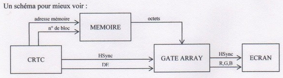

Les entrailles du CRTC...
=========================

Ramlaid © Mortel, Avril 1999 V1.2


Préface
-------

Ce document présente de façon la plus précise possible le Cathode Ray Tube Controler (CRTC) de l’Amstrad CPC, ainsi que les différentes possibilités offertes par sa programmation. Les informations contenues dans ce document sont un recueil des connaissances glanées lors de différents meeting auxquels j'ai participé, ainsi que de la lecture de différents documents et articles concernant ce sujet et j'espère que les informations y figurant sont les plus exactes possibles. N'hésitez pas à me faire parvenir vos remarques et vos corrections à propos de ce document.
Avant de commencer, je tiens à remercier Madram, pour ses éclaircissement plein d'entrain, Shap, pour sa documentation constructeur sur le CRTC, Offset, pour ses précieuses aides, et tout de même Gozeur pour sa première approche du CRTC donné dans un cours qui maintenant semble quelque peut erroné. Sans oublier Longshot et Overflow qui ont été les précurseurs en ce qui concerne la programmation de ce petit bijou qu'est le CRTC.

I) Introduction
---------------

Dans ce document, je commencerais par décrire le fonctionnement général du CRTC au sain de l'Amstrad CPC, ensuite, je décrirais quelques techniques de programmation pour bien exploiter celui-ci. Ce document n’a pas pour but de donner des programmes tout fait, mais d'expliquer, le plus en détail et le plus clairement possible comment marche le CRTC, et ce qu'on peut faire avec celui-ci, c'est donc à chaque codeur, à partir de ce document de créer ses propres routines et ensuite et surtout, d'exploiter au maximum les différentes possibilités. Par exemple, réaliser une rupture verticale ou une RVI n'est pas un but en soit, mais doit permettre de créer des nouveaux effets exploitant ces techniques. Pourquoi ne pas créer un ‘Doom like’ à l’aide d’une RVI ou d'une rupture ligne a ligne sur CPC?

II) Présentation de la bête
---------------------------

Le Cathode Ray Tube Controller (CRTC) est le composant de l’Amstrad permettant d'organiser la mémoire vidéo du CPC.

### 1) Implantation dans l’ Amstrad CPC

Le CRTC a pour but de sélectionner les octets de la mémoire du CPC qui doivent être affichés sur le moniteur, par exemple, en standard, le CRTC sélectionne les octets à partir de l'adresse #C000 et envoie une première ligne contenant 80 octets. C’est également lui qui donne la largeur de l'écran visible, sa hauteur et bien d'autre paramètres. Mais comment ses octets sont-ils affiché par le canon a électron son votre moniteur ?

En fait, les octets sélectionnés par le CRTC sont envoyés au Gate Array, qui en fonction du mode et des couleurs des encres permet de décoder ces octets, et de Les envoyer sur l'écran, sous la forme de valeur R, G, B (Red, Green, Blue).
Pour se synchroniser, le Gate Array (ainsi que le canon à électron) reçoit la Hsync (Horizontal Synchronisation) du CRTC, ainsi que, bien sur, les octets de la mémoire centrale du CPC, à transférer en pixel pour l’écran.



Quelques indications supplémentaires :

DE : Display Enable, permet d'indiquer au Gate Array quand il doit afficher ce qu'il reçoit de la mémoire (DE=1) ou quand il doit afficher du border (DE=0).

adresse mémoire : le CRTC indique quels octets doivent être pris dans la mémoire, ces adresses vont de #0000 à #3000, c’est avec le n° de bloc que l'on retrouve l'adresse exacte.

n° de bloc : le CRTC indique à la mémoire dans quel bloc elle doit prendre ses adresses.

On peut de plus remarquer que la sélection d'adresse se fait avant de passer par le Gate Array, ce qui explique que les changements de bank (effectués par le Gate Array) ne sont pas pris en ‘compte par la vidéo, donc seulement les 64ko de mémoire de premier plan sont pris en compte.

### 2) Les registres du CRTC

Avant de décrire en détail le CRTC, et son fonctionnement, je vous donne brutalement la liste des registres, leurs valeurs standard, ainsi que leur les valeurs possibles de chacun des registres. (Je vous donne ce tableau en anglais, car c’est plus explicite a mon avis... Et plus simple pour moi)


Je ne donnerais dans ce dossier (pour l'instant) pas d’information supplémentaire sur les registres 10,11 (gestion du curseur de l'écran), 14 et 15 (adresse du curseur de l'écran), 16 et 17 (position du crayon optique), car je ne penses qu’ils soient primordiaux.

### 3) Adressage des registres du CRTC

Pour envoyer (pour lire) des valeurs au CRTC, il faut d'abord lui dire dans quels registres on envoie la valeur, et ensuite quel valeur on affecte au registre sélectionné. Voici les ports, ainsi que le mode d’adressage :

Port de sélection de registre : #BC00
Port d'envoi de valeur : #BD00
Port de lecture de valeur : #BF00

Le port #BE00 sert à la lecture de l’état du CRTC, mais n'ayant pas fait de recherche de ce coté, je ne m'étendrais pas plus dessus.

Pour un peu plus détailler tout ça, voici la signification bit à bit des adresses de port :
	bit 6 à 0 : adressage du CRTC
	bit 1 et 0: type d’adressage :
		00 : sélection de registre
		01 : écriture de valeur
		10 : lecture de l’état
		11 : lecture de valeur
	les bits 7,5,4,3,2 sont à 1.

Ce qui donne bien les valeurs de ports indiqués plus haut. Quelques exemple d'adressage du CRTC :

```BASIC
OUT &BC00,1
OUT &BD00,32
OUT &BC00,16
Val=INP(&BF00)
```

```ASSEMBLEUR
LD BC,#BC01
OUT (C),C
LD BC,#BD20
OUT (C),C
LD BC,#BC10
OUT (C),C
LD BC,#BF00
IN A,(C)
```

Signification

On redimensionne l'écran en lui donnant une largeur de 32 mots (64 octets) au lieu de 40 mots (80 octets) en standard. Pour cela, on envoie la valeur 32 dans le registre 1.

On lit le poids fort de l'adresse du crayon optique. Pour cela, on lit la valeur du registre 16, et on la stocke soit dans val, soit dans A.

III) Le fonctionnement du CRTC
------------------------------

Cette partie (très intéressante, et très instructive, j'espère !) vas vous permettre de mieux comprendre le fonctionnement du CRTC. Tout d’abord, je vais expliquer comment sont pris les octets dans la mémoire, suivant quels critères, ensuite je décrirais comment sont affichés les octets en horizontal et en vertical, j'en profiterais pour décrire comment marche les différents registres.  Enfin, je donnerais quelques différences entres les CRTC ainsi qu’un programme permettant de les différencier.

### 1) De la mémoire vers l’écran a l'aide du CRTC

Avant de commencer, je vous rappel brièvement comment est affichée la mémoire sur votre moniteur, car c’est un peu bizarre...


Voilà déjà qui est un peu plus clair. Comme vous pouvez le remarquer, la mémoire n'est pas linéaire, car pour passer d’une ligne a l’autre, on doit ajouter #800 (c'est le fameux BC26 !), mais vous remarquerez également qu'on ne fait pas ça tout le temps, en effet, toutes les 8 lignes, on reviens à l'adresse de la première des 8 dernières lignes et on y ajoute #50, cette valeur correspondant à la largeur de l'écran visible (80 octets).

On appel les zones #C000-#C7FF, #C800-#CFFF,.…, #F800-#FFFF les blocs mémoires respectivement numérotés 0, 1, ., 7. On a donc 8 blocs, qui correspondent aux 8 lignes d’un caractère classique. Lorsqu'on reviens au bloc 0, on additionne la largeur de l'écran visible pour continuer a parcourir les lignes, ce qui donne par exemple après #F800 (bloc 7) la ligne #C050 {bloc 0). Cette notion de bloc est très importante, ne l’oubliez pas pour la suite du cours...

Pourquoi une telle organisation ? Cela vient du câblage du CRTC et de son fonctionnement de départ. En effet, le CRTC est normalement prévu pour faire de l'affichage texte et pour gérer donc des lignes de caractères. Je penses que ça doit venir d’une certaine segmentation de la mémoire qui doit permettre (au niveau matérielle) d'accélérer l'adressage.

Après avoir vu le résultat à l'affichage sur l'écran, on vas voir comment le CRTC procède pour afficher ces lignes. Tout d’abord, l’adresse standard de début de la mémoire vidéo est #C000, ou plus précisément, l'adresse du premier octet du bloc 0, et correspond en fait aux valeurs des registres 12 et 13, plus souvent appelés offset mémoire.

Petite description de ces registres :


Nous allons détailler tout ça. Tout d'abord, la valeur de l’offset représente le nombre de MOTS (2 octets) de décalage par rapport à la page vidéo. La page vidéo (maintenant que j'en ai parle, il faut que je l'explique), correspond à la bank vidéo dans laquelle vont être prises les données.

Voici la signification de ces 2 bits de page vidéo :


Remarque : Le CRTC ne peut pas adresser les octets des 64Ko supplémentaires, même si on connecte par exemple une bank supplémentaire entre #4000 et #7FFF. Pourquoi ? Bonne question, je n'en sais rien. Non, ce n’est pas vrai, je penses que ca doit venir du fait que c'est le GATE ARRAY qui s'occupe de faire les sélections de bank, et comme le CRTC ne reçoit rien venant du GATE ARRAY (voir schéma d'implantation), il n°en prends donc pas compte. Par exemple: si vous connecter une bank (du genre OUT #7F00,#C7) et que vous afficher votre page vidéo qui se trouve en #4000, le CRTC affichera ce qu’il y a en #4000 et non pas le contenu de la bank que vous avez connectée. Voilà pour cette remarque...

Et vous allez me demander pour la taille vidéo ??? Bon, je vous fait un autre tableau


Pour l'explication, la taille vidéo définie combien d’octets le CRTC peut (au maximum) parcourir, sinon, il boucle, c'est a dire que lorsqu'il a atteint la taille maximum, il revient au premier octet. En standard, la taille vidéo est de 16Ko.

Maintenant, nous allons combiner tout ça. Alors comment le CRTC calcule-t-il l'adresse du premier octet à afficher ? Simple :
Adresse premier octet = valeur bank vidéo*#4000 + offset * 2

La valeur de la bank vidéo correspond à 0,1,2 ou 3 (codage binaire correspondant au tableau) pour les banks #0000, #4000, #8000 et #C000. On remarque que la valeur de l’offset peut varier entre #000 et #3FF, donc on peut commencer sur les adresses paires entre #C000 (ou dans une autre bank) et #C800. Eh oui ! On remarque que l’offset ne permet que de donner une adresse dans le premier bloc mémoire, donc chaque écran standard commencera toujours sur un bloc zéro (important !). Ensuite il affiche les 7 autres blocs différents sur les lignes qui suivent, puis additionne la largeur de l’écran pour la 8ème ligne, et ainsi de suite, comme sur le schéma de la mémoire vidéo.

Voilà (brièvement) comment sont affichés les octets de la mémoire en standard sur le moniteur, maintenant, nous allons voir comment sont gérés les écrans en horizontal puis en vertical.

### 2) Gestion d’un écran en horizontal

Le fonctionnement en horizontal (et en vertical !) n'est pas compliqué en soit, mais il faut donner quelques informations importantes sur quelques points...

Nous allons ici parler des registres 4, 5, 6, 7, 8 et 9. Mais d'abord, sachez que intenement, le CRTC contient plusieurs registres compteur (invisible pour l’utilisateur) qui donne par exemple le nombre de lignes de caractère déjà affichées, et un autre qui indique le numéro de bloc mémoire courant. Il y a également un registre compteur pour l’offset mémoire. (cpt_off, ept_lc, cpt_b) Maintenant reste à savoir quand est ce que le CRTC décide qu'il y a du border sur l'écran, quand est ce que la VSync démarre (activation du DE, voir schéma d'implantation !), et quand est ce qu'il redémarre un nouvel écran ete. Un petit schéma (encore un !) pour tout de suite s'éclaircir l'esprit :


Vous me direz, pourquoi une organisation aussi tordue ? Pourquoi ne pas avoir pris comme point de départ le haut du moniteur ??7 Et bien, c’est simple c'est comme ça que marche le CRTC, il n’a pas de notion du haut ou du bas du moniteur, c’est le moniteur (récupérant une Vsync) qui positionne ce qu'il reçoit du CRTC.

Alors récapitulons tout ça... Prenons l'exemple d’un écran normal (comme sur le schéma), lors du démarrage du CPC. Lorsque l'écran visible commence à être généré, le compteur d'offset est initialisé à la valeur des registre 12 et 13, c’est à dire qu'il pointe sur les 2 premiers octets en #C000, le compteur de ligne de caractère, ainsi que le compteur de bloc sont à 0.
Le CRTC affiche alors la ligne #C000-#C04F (bloc 0), ensuite le compteur de bloc s'incrémente d’un et on affiche le bloc suivant, à savoir la ligne #C800-#C84F, et ainsi de suite jusqu'au bloc 7.
Au bloc 7, on boucle sur le bloc 0, et ce parce que la valeur du registre 9 (donnant la borne supérieure du compteur de bloc (=> nb blocs — 1) a été atteinte. Puisqu'on revient sur un bloc 0, alors le CRTC sait qu’on change de ligne de caractère, donc il incrémente le compteur de ligne de ‘caractère d’un. C'est à ce moment que le CRTC met à jour le compteur d'offset en additionnant la largeur de l'écran, donc la ligne suivante est #C050-#C09F. Et ainsi de suite pour le compteur d’offset et le compteur de bloc.

Lorsque le compteur de ligne de caractère arrive à la valeur du registre 6 (25 en standard), le CRTC arrête d'afficher de la mémoire et affiche maintenant du border. Donc notre écran visible fait bien 25*8=200 lignes de haut, ce qui est la hauteur standard.
Puis, lorsque le compteur de ligne de caractère arrive à la valeur du registre 7 (30 en standard), le CRTC va générer une Vsync, qui va permettre de positionner l’écran sur le moniteur, À noter que la valeur du registre 7 ne correspond pas à la position de l'écran sur le moniteur, mais à l'endroit où est généré la Vsync par rapport au début de l'écran, ce qui influence bien sur la position de l'écran, c'est une erreur que beaucoup de personne faisait avant (moi compris), et je penses que vous verrez la différence, d’ailleurs, beaucoup de chose s'explique à partir de cela dans le reste de ce cours.
Enfin, lorsque le compteur de ligne de caractère arrive à la valeur du registre 4 (borne supérieur du compteur de ligne de caractère), le CRTC recommence un nouvel écran. I réinitialise Le compteur d'offset à la valeur des registres 12 et 13, remet le compteur de ligne de caractère et de bloc à 0.

Quelques petits calcul s'impose. Le CRTC affiche donc 200 lignes d'écran visible, ensuite il affiche 5x8 lignes de border (en effet, reg 1-25 et reg 7=30), puis il génère une Vsync (qui fait à peu près 16 lignes), et affiche le reste de border, de 8x8 lignes en tout (reg 4=38, reg 7-30). Notez également que la Vsync est générée en même temps que le border, donc la Vsync est comprise dans les 8*8 lignes de border suivante, Tant que j'y suis sur les lignes, je vous fait remarquer qu'en tout, et en standard le CRTC affiche 312 lignes. En effet, il affiche 39 lignes physique (on peut les appeler comme ça (reg 4=38, et on démarre à 0)) de 8 lignes de haut (reg 9+1), soit 312 lignes. Sachant qu'une ligne fait 64 NOPs, alors un écran est fait en 19968 NOPs. Un NOP=1 microseconde, donc un écran est balayé en 0.019968 seconde. Combien d'écran balayé en 1 seconde ?

règle de 3 : 1/0.019968-50,0801

Cane vous dit rien ??? Et oui ! C'est la fréquence de balayage du moniteur : 50 images par seconde... Donc, on vois bien que si on n’a pas exactement 312, le moniteur risque de tirer un peu la tronche (en fait, vous pourrez voir votre écran sauter...) mais en réalité, les moniteurs sont assez souples, et permettent quelques débordements (pas trop énorme quand même !)

Je vois le petit blond à lunettes qui se plaint de ne pas avoir eu d'info sur les registres 5 et 8. Non, je ne les ai pas oublié, j'y viens.

Le registre 5 (qui a pour valeur standard 0) correspond au retard vidéo du début de l'écran. C'est à dire que le CRTC attendra le nombre de ligne indiqué par le registre 5 avant de commencer à générer son nouvel écran. Donc si le registre 5 est à 2 avant le début de l'écran le CRTC laissera 2 lignes de border (c’est ce qu’il génère en standard avant chaque nouvel écran) avant de commencer à générer un nouvel écran. Je rappel que la valeur du registre 5 est prise en compte au moment du démarrage d’un nouvel écran, si le registre 5=0, il commence tout de suite, sinon il attends le nombre de ligne, donc le reg 5 doit être initialisé à sa nouvelle valeur avant le début de ce nouvel écran (noter ça, ca pourra servir !).

Le registre 8 maintenant. Celui-ci est un peu spécial, et très peu utilisé finalement. Encore un p'tit tableau avant d'expliquer son fonctionnement :


Ah... Déjà, les valeurs 0 et 2 ne font rien de spécial, c'est le mode standard, donc pas de problème, les écrans seront ‘normaux.
La valeur 1 permet de décaler l'écran d’une demie ligne à chaque balayage, c'est à dire que votre écran va vibrer en quelques sortes. Vous pouvez essayer cette valeur en Basic, vous verrez votre écran vibrer, c'est le mode entrelacé classique des autres machines (est-ce exploitable sur CPC ?). Enfin, la valeur 3 permet de faire de l’entrelacement de l'écran et de la vidéo, c'est à dire qu' final, le CRTC affichera une ligne sur 2, et vous aurez 2 fois plus de lignes sur votre écran. Mais ce mode est buggée sur les CPC, car en fait il demande une synchronisation assez pointu (c'est à dire qu'on doit être exactement en 50 hertz) pour un résultat à peu près correct.

Il est toujours possible d'essayer de “bidouiller” quelque chose avec ce registre 8, ca n'a pas encore été fait dans une démo par exemple, alors, pourquoi pas ??? A vous de voir !
Bon, après avoir vu le fonctionnement du CRTC en horizontal, on peut tirer quelques règles de calcul et de fonctionnement à respecter pour que le CRTC travail correctement. Les voici :

	nb lignes = Σ(val reg 4 + 1) * Σ(val reg 9 + 1) + Σ(val reg 5)

Le nombre de ligne doit toujours faire (approximativement) 312 lignes pour avoir un écran stable. (en fait, il faut que le nombre de linge soit identique d'une synchro à une autre pour avoir un écran stable). I est bon de respecter cette règle de calcul le plus souvent possible. Pourquoi avoir mis E des valeur ?? Car c’est la somme des différentes valeur des registres pendant 1 écran, mais nous en reparlerons plus tard.

Quelques règles de bon fonctionnement maintenant.

	1 : val reg 7 <= val reg 4

Cette règle s'applique en fin d'écran, car le CRTC doit absolument générer une (et une seule) Vsync pendant un écran. Si pendant tout un balayage le CRTC ne peut pas générer une Vsync, alors il y aura automatiquement un plantage méchant.

	2 : val reg 4 >= cpt_lc

En effet, si à un moment de son écran, le compteur de ligne de caractères est à 10 et subitement, on envoie 9 dans le registre 4, alors le compteur de ligne va devoir boucler pour atteindre la valeur 9, et on a ce qu’on appel un overflow du registre 4 ! Ca ne provoque pas un plantage, mais c'est assez embêtant quand même.

	3 : val reg 9 >= cpt_b

Et bien là, c’est exactement le même problème que pour le registre 4, c'est à dire que si le compteur de bloc est à 6 et subitement on envoie 3 dans le registre 9, alors il y aura un overflow du registre 9.

Avec toutes ces informations, je penses que vous pouvez déjà tirer quelques conclusions si vous vous êtes déjà risqué à faire de la rupture classique ou de la rupture ligne à ligne, mais j’en reparlerais plus tard.

### 3) Gestion d’un écran en vertical

En ce qui concerne la gestion d’un écran en vertical par le CRTC, c'est très similaire à la gestion en horizontal, mais avec des registre différents bien sur ! Nous parlerons ici des registre 0,1,2,3. Je rappel que le CRTC possède des registres internes lui permettant de travailler, et dans le cas de la gestion d’un écran en vertical, il y a 2 registres internes concernés, pour compter les colonnes, et les offsets verticaux (pour simplifier, en fait, c'est un peu différent) : cpt_c, cpt_offv. Encore un petit schéma pour tout expliquer...


Comme vous pouvez le remarquer, c’est encore plus simple que la gestion en horizontal, il n°y a qu’un registre compteur de colonne (cpt_c) et un compteur d'offset vertical (cpt_offv).

Pour le compteur d’offset, le CRTC affiche chaque mots (2 octets), puis incrémente le compteur d’un. Bien sur les 2 octets sont pris dans la case mémoire correspondant à l’offset courant et au bloc courant, qu’on retrouve dans le compteur de bloc (cpt_b). Par exemple si l'offset courant (cpt_off) vaut #3000 et que le compteur de bloc (cpt_b) vaut 0, l'adresse de début de ligne sera #C000, à la ligne suivante, le compteur de bloc vaudra 1 et on aura comme adresse de début de ligne #C800, l'offset n’ayant pas changé. Par contre le compteur d’offset vertical lui s'incrémente d’un, et est réinitialisé à chaque début de ligne.

Pour ce qui est du compteur de colonne, celui ci s'incrémente comme le compteur d'offset vertical, c’est à dire tous les 2 mots, ce qui correspond à un NOP, soit une microseconde.
Au début de ligne, ce compteur vaut 0, le CRTC génère de l'écran. Lorsque ce compteur atteint la valeur du registre 1, le CRTC va alors générer du border.
Lorsque le compteur de colonne atteint la valeur du registre 2, alors le CRTC génère une Hsync. Là on peut faire la même remarque que pour le registre 7 de la gestion horizontale, le registre 2 ne donne pas la position de l'écran, mais la position de la Hsync sur la ligne, ce qui influe sur la position de l'écran.
Enfin, lorsque le compteur de colonne atteint la valeur du registre 0, alors le CRTC recommence à générer une nouvelle ligne.
En standard, le registre 0 vaut 63, c’est à dire qu’une ligne est composée de 64 colonnes physiques, soit 64 NOPS par lsgne.

Donc le fonctionnement en vertical est similaire au fonctionnement en horizontal, on a un compteur, et les registres équivalents aux registres 4,6,7 sont respectivement les registres 0.1.2.
En ce qui concerne le registre 3, celui ci donne simplement la largeur en NOP (microseconde) de la Hsync. Pour un fonctionnement correct, il faut laisser une Hsync de 4 NOPS au minimum (la valeur peut être entre 0 et 15), en dessous, l'écran n’a pas le temps de se synchroniser.

De ces informations, on peut extraire quelques règles de fonctionnement :

	5: Σ(val reg 0 + 1) = 64

Chaque ligne doit faire 64 colonnes, sinon, le canon à électron ne peut pas se synchroniser correctement.

	6: val reg 2 <= val reg 0

Le CRTC doit pouvoir générer une Hsync à la fin de la ligne, si cette condition n'est pas respectée, c’est un plantage assuré !

### 4) Les différent types de CRTC, adaptation

IV) Les applications
--------------------

Dans ce chapitre, je vous expliquerais les différents principe et le fonctionnement de plusieurs techniques utilisant le CRTC, mais je vous laisserais le soit de coder ces techniques. De plus, il ne faut pas oublier que ces techniques ne sont la que pour créer de nouveaux effets, donc il n'est pas utile, par exemple, de coder une rupture verticale ou une RVI, si ce n'est que pour le dire. À vous d'utiliser ces techniques pour faire de nouveaux effets.
Enfin, j'aimerais qu'après la lecture de cette partie, ainsi que le reste du cours, tout le monde sache pourquoi il envoie tel ou tel valeur au CRTC, parce qu'il sait ce que ca vas provoquer, et non pas parce qu’il a vu ca dans un listing quelconque ou parce ce qu'on lui a dit de faire comme ca.

### 1) L'overscan

L'overscan permet d'obtenir des écrans vidéo qui couvrent tout le moniteur, sans border visible en somme. Cette remarque peut vous mettre la puce à l'oreille, en effet, il faut d'une part modifier la largeur et la hauteur de l'écran visible, donc augmenter les registres 1 et 6, ensuite repositionner” l'écran grâce aux registres 2 et 7 et bien adresse la mémoire grâce aux registres 12 et 13.
Mais voilà déjà les premiers ‘problèmes’ qui arrivent... Lorsqu'on augmente la hauteur de l'écran, il est possible de dépasser la capacité d'affichage du CRTC, à savoir les 16 ko de la taille écran standard (cf tableau p5). Pour savoir si ce problème arrive (en fonction des valeurs que vous donnez aux registres 1 et 6), il suffit de calculer la taille mémoire de votre écran qui est égale à :

	Taille écran = (reg1*2) * (reg6*(reg9-1)) octets

Si cette taille dépasse 16384, alors les 16ko standard ne suffisent plus, donc il faut passer en un écran de 32ko en changeant la valeur du registres 12 (of p5).
Lorsqu'on modifie la valeur du registre 1, les lignes font reg1*2 octets de large, par exemple, pour une valeur de 48, on aura 96 octets de largeur. Bien sûr ca influe sur l'affichage, car les lignes ne font plus 80 octets de large comme en standard, donc il faut revoir la routine de BC26 ! Par contre, on augmente toujours de la largeur de l'écran (reg1) toutes les 8 lignes à savoir à chaque ‘bouclage” de bloc.

Une fois la taille de l'écran augmenté, il faut repositionner l'écran, et pour cela, on peut changer les endroits où sont générés les HBL et VBL, grâce aux registres 2 et 7, ce qui modifiera bien l'endroit où le CRTC commencera à générer l'écran. La modification du registre 2 aura pour effet de déplacer l'écran de gauche à droite, et celle du registre 7 de haut en bas.
Enfin, il ne reste plus qu’à mettre à jour l’offset de l'écran, en changeant la valeur des registres 12 et 13. 1 faut donc prendre en compte la taille écran calculée plus haut, mais également indiquer quelle sera la bank de départ. Si votre écran fait 32ko, je vous conseil (pour commencer) d'utiliser la zone #8000-#FFFF. II faut donc sauvegarder le système (qui se trouve approximativement entre #A400 et #BFFF), ainsi que changer la place de la pile (qui démarre en standard en #BFFE), pour ne pas avoir n'importe quoi d’affiché sur votre écran final... Donc, dans ce cas, la bank de départ sera La bank n°2 (ef p5) et alors, votre écran (s'il fait 32ko) enchaînera tout seul les 2 banks (#8000-#BFFF, puis #C000-#FFFF).

En ce qui concerne l'affichage dans cet écran overscan, dans le cas où l'écran fait 32ko, il est judicieux de déplacer le début du premier écran, pour éviter d’avoir une transition fâcheuse entre les 2 banks, comme par exemple avoir un morceau de ligne en #8000-#BFFF et un autre en #C000-#FFFF. Je vous laisse faire les caleuls, en fonctions des registres concernés (reg12, reg13 et largeur de l'écran reg1).

Un petit exemple d'overscan pour voir un peu comment ca marche, avec la liste des valeurs de départ:


Quelques explications sur les valeurs choisies :

- registre 1 = 48 : c'est la largeur minimum pour couvrir toute la largeur du moniteur, de plus cette valeur est relativement simple pour le BC26. Enfin, c'est la valeur qui permet d'utiliser le maximum de mémoire en largeur (Si la valeur était supérieure, il y aurait un morceau d'écran ‘en dehors” du moniteur, donc perte de mémoire pour l'affichage).

- registre 2 = 50 : pas trop de commentaires, c’est la valeur qui permet de coller l'écran a gauche. À noter que sur certains moniteur, la HBL n'est pas toujours générée exactement au même endroits, donc ca peut poser des problèmes de centrage (c’est un problème qu'a résolu Elmsoft dans ses jeux en demandant de centrer a la main son écran.)

- registre 6 = 36 : permet d’avoir toute la hauteur du moniteur.

- registre 7 = 34 : positionne l'écran en haut du moniteur.

- registres 12-13 = #2C10 : tout d’abord, la bank de départ est la bank n°2 (#8000-#BFFF), avec les bits 5-4 à 10. Ensuite, la taille de la page est de 32ko (bits 3-2 à 11), et enfin, l'offset de la page commence à #0010, soit l'adresse mémoire #8020. Cette valeur permet d’avoir un transition sans problème entre les 2 banks de 16ko (#8000-#BFFF puis #C000-#FFFF). En effet, dans 16ko, on peut avoir au maximum 21 lignes complètes de caractères de 96 octets de large, soit en taille mémoire 96*21*8 = 16128 octets, il reste donc 16384-16128 = 256 octets soit 1 ligne caractère de 32 (= #20) octets de large. Il est donc judicieux d'enlever ces 20 octets de l'écran overscan, et donc d'avoir exactement 21 lignes de 96 octets de large, ainsi, la transition entre les 2 banks mémoire se fera d’une ligne caractère à une autre (et pas en plein milieu de la dernière ligne de la première bank...).

Voilà, j'en ai fini avec l’'overscan, bien sur, cet exemple n’est qu’un exemple d’overscan possible, il y a bien d'autres redimensionnement d’écran qui peuvent être fait. Par exemple, essayez de voir comment on peut simplifier grandement le BC26 avec un écran de 64 octets de large !

### 2) Le split-CRTC

Beaucoup me demanderons ce qu'est le “split-CRTC”.. Avez-vous déjà vue un scroll en split raster ? N'avez-vous jamais vu ce genre de scroll au dessus d’un dessin en 4 ou 16 couleurs, comme dans la Vectrix part d’Elmsoft, ou encore dans Prehistorik 2 du même (génialissime) auteur ? La question que je me suis longtemps posée était comment ce bougre a-ti fait pour changer 4 encres en seulement 4 cycles. Et bien il ne l’a pas fait ! En fait, et c'est le principe du split-CRTC, ce que l’on voit n'est pas de l’écran mais du border, ce qui permet de faire défiler un texte sur un graphe sans problème.
On peut done, grâce au CRTC faire afficher, un coup de l'écran, un coup du border... Bien sûr, cet effet doit être codé dans une synchro, c’est à dire synchronisé sur la VBL du CRTC, récupéré grâce au PPI, mais je n’expliquerais pas ceci dans ce cours, en supposant que Vous avez déjà codé un simple raster ou mieux un split raster dans le cas présent.
Le principe du split-CRTC est donc de faire alterner écran et border sur une ligne, et ceci ce fait grâce aux registre 6 sur les CRTC 1 et 4, et au registre 8 (buggé !) sur les CRTC 0 et 3.

Pour ce qui est du CRTC 1 et 4, on modifie le registre 6 (qui correspond à la hauteur de
l'écran affiché) que l’on mais alternativement à 1 (ou plus) pour afficher de l'écran, et à 0 pour afficher du border. Cela reste logique, puisque dans le cas où la hauteur est à 0 le CRTC affichera du border, (on remarque que ces CRTC prennent en compte la hauteur de l’écran durant l'affichage d’une ligne) et lorsque la hauteur sera de 1 (ou plus), le CRTC continuera d’afficher l'écran en cours (en ayant incrémenté le compteur de colonne et d'offset ligne pendant le temps où il affichait du CRTC, donc il se retrouve au même endroit qu'en affichage “normal”).
En ce qui concerne les CRTC 0 et 3, c'est vraiment bizarre (je n’ai pas encore l'explication il faut mettre le registre 8 à 0 pour afficher de l'écran, et à 48 (??) pour afficher du bord Sinon, ca marche exactement comme dans le cas des CRTC 1 et 3.
Voilà pour cette petite ‘bidouille’ du CRTC qui peut-être utile de temps en temps !

### 3) La rupture horizontale

Là démarre vraiment l’une des techniques intéressantes permettant d'exploiter au mieux le CRTC. Tout d’abord, la rupture horizontale, inventée par Longshot, avait pour but de “découper” l'écran en hauteur, permettant ainsi d’avoir des offsets différents pour chaque zones écrans’. Pourquoi vouloir découper l’écran en hauteur et changer les offsets plusieurs fois pendant une synchro ???
Tout d‘abord, au niveau de la mémoire, cela permet d’avoir une zone écran entre #4000 et #7FFF, et une autre entre #C000 et #FFFF par exemple. On peut donc arriver à avoir un écran pseudo-overscan sans utiliser une zone mémoire de 32Ko, mais 2 zones de 16Ko, ce qui permet dans ce cas d'éviter de sauvegarder le système d'exploitation comme expliqué dans le chapitre 1 sur l’overscan.
Ensuite, pouvoir changer les offsets des zones écrans indépendamment les uns des autres pendant une synchro permet par exemple de faire défiler une zone écran (grâce à l’offset) en ayant une autre zone écran fixe. Vous avez sûrement déjà vu des scrolls-text relativement rapide, réalisé grâce à une rupture horizontale, cela permet de faire défiler une zone mémoire importante en seulement 2 adressages de CRTC (reg 12 et 13)! Essayez de faire un scroll-text de 32 lignes de haut par 96 octets de large en 14 lignes de temps machine sans utiliser le “hard” du CRTC ! Mais ceci n’est qu'un exemple d’utilisation de rupture horizontale, il y a beaucoup d'avantage à utiliser cette technique, en général, on y gagne en fluidité par rapport au même effet qui serait réalisé en soft.

La technique de la rupture horizontale consiste à changer plusieurs fois, si nécessaire, la hauteur physique (reg 4) de l'écran pour qu’un nouvel offset soit pris en compte pour chaque zone écran. En effet, l'offset est rechargé à chaque fois que le compteur de ligne caractère interne) repasse à 0, donc quand la valeur du registre 4 est atteinte par ce compteur. Si on respectait à la lettre la règle 1 (val reg 7 <= val reg 4), alors le CRTC générerait à chaque zone écran une VBL, ce qui n'est pas propre. Pour éviter de générer une VBL à chaque zone écran, il faut mettre le registre 7 à l’overflow en début de synchro, ensuite le CRTC va générer les différentes zone écran, et a la fin de synchro, il faut indiquer au CRTC qu'il doit générer une VBL (et une seule par écran complet !) pour que le moniteur puisse se synchroniser correctement.
De plus, pour que l'écran complet soit stable, il faut que le total des lignes affichées par le CRTC soit toujours égal à 312, donc que la somme des hauteurs des zones écran soit égal à 38. Je vous rappel que les valeurs envoyés au registre 4 sont égale à la hauteur de la zone écran moins un, car le compteur de ligne caractère démarre à 0.

	nb lignes = Σ(val reg 4 + 1) * Σ(val reg 9 + 1) + Σ(val reg 5) = 312

Un petit schéma expliquant comment réaliser ce genre d'effet :


Quelques remarques à propos de ce schéma. Tout d’abord, vous remarquerez que la forme du schéma est plus ‘conventionnel par rapport au schéma de fonctionnement en horizontal, et ce parce que je penses que c'est plus simple à expliquer sous cette forme dans le cas de la rupture horizontale.
Pour ce qui est de l’overflow du registre 7, il faut que le CRTC ne puisse à aucun moment générer de VBL durant l'affichage des différentes zones écrans. La méthode générale consiste à mettre le registre 7 à une valeur qui est supérieure à la plus grande hauteur des zones écran, ainsi, pour toute les zones écrans, la valeur du registre 7 ne sera jamais atteinte par le compteur de ligne caractère, et donc, aucune VBL ne sera générée. Par habitude, on met le registre 7 à 255 pour l’overflow, ce qui marche quel que soit les tailles des zones écrans créées.
En fin de synchro, il faut remettre le CRTC à une valeur ‘normale’, en fait, il faut mettre le CRTC à une valeur lui permettant de générer une VBL par écran complet. Là aussi, on a l'habitude de mettre le registre 7 à 0, ainsi, au début de la première zone écran de la rupture, on aura une VBL de générée.

### 4) Le scroll vertical
### 5) La rupture 8 lignes-8 lignes
### 6) La rupture ligne à ligne
### 7) Correction du décrochage du registre 2
### 8) La rupture verticale

Qui a dit qu'on avait besoin d’une HBL pour faire une rupture verticale ? ? ? ? Pas moi ! Suffit de faire un overflow du reg 2 (ex : 255) en début de ligne, et de le mettre à 0 en fin de ligne, comme pour la rupture horizontale ! ! ! Plus de HBL, écran collé ! !! !

### 9) La RVMB
### 10) La RVI


